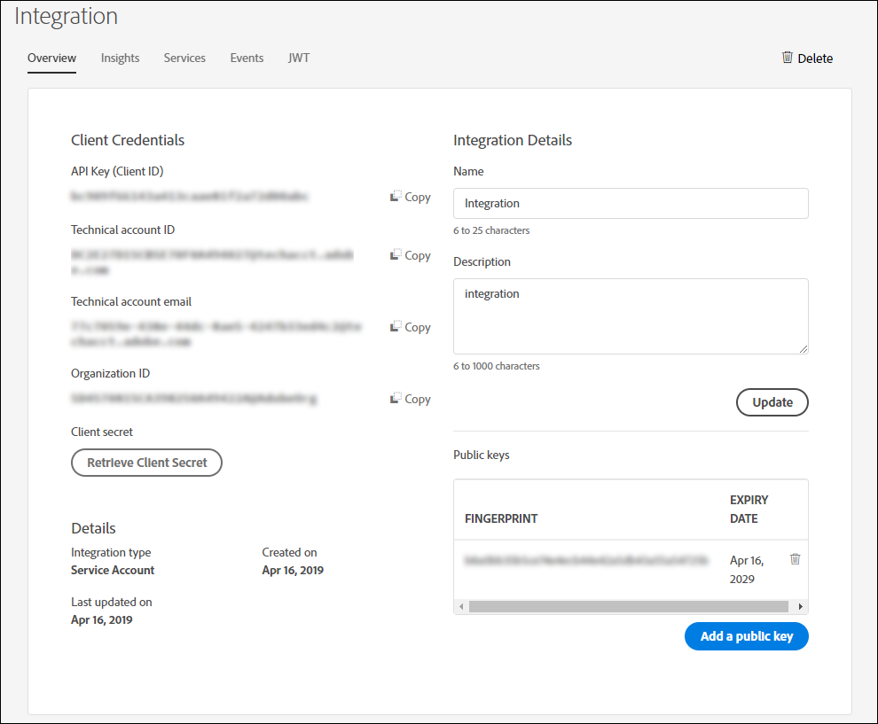

# Konfigurera tjänsten Automated Forms Conversion {#about-this-help}

I den här hjälpen beskrivs hur en AEM-administratör kan konfigurera tjänsten Automated Forms Conversion för att automatisera konverteringen av sina PDF-formulär till adaptiva formulär. Den här hjälpen är till för IT-administratörer och AEM-administratörer i din organisation. Informationen baseras på antagandet att alla som läser den här hjälpen känner till följande tekniker:

* Installera, konfigurera och administrera Adobe Experience Manager- och AEM-paket,

* Med operativsystemen Linux och Microsoft Windows

* Konfigurera SMTP-e-postservrar

>[!VIDEO](https://video.tv.adobe.com/v/29267/)

**Titta på videon eller läs artikeln för att konfigurera tjänsten Automated Forms Conversion**

## Onboarding{#onboarding}

Tjänsten är kostnadsfri för kunder som har AEM 6.5 Forms och AEM 6.4 Forms On-Premise samt företagskunder med Adobe Managed Service. Du kan kontakta Adobes säljteam eller din Adobe-representant för att få tillgång till tjänsten.

Adobe ger åtkomst till din organisation och ger de behörigheter som krävs till den person som är utsedd som administratör i din organisation. Administratören kan ge AEM Forms-utvecklare (användare) i organisationen åtkomst till tjänsten.

## Förutsättningar {#prerequisites}

Du behöver följande för att kunna använda tjänsten för automatisk formulärkonvertering:

* Tjänsten Automatisk formulärkonvertering är aktiverad för din organisation
* Ett Adobe ID-konto med administratörsbehörighet för konverteringstjänsten
* En AEM 6.5- eller AEM 6.4-författarinstans som körs med det senaste AEM Service Pack-paketet
* En AEM-användare (i din AEM-instans) som är medlem i användargruppen formulär

## Konfigurera miljön {#setuptheservice}

Innan du använder tjänsten förbereder du AEM-författarinstansen för att ansluta till tjänsten som körs i Adobe Cloud. Utför följande steg i den listade sekvensen för att förbereda instansen för tjänsten:

1. [Hämta och installera AEM 6.5 eller AEM 6.4](#aemquickstart)
1. [Hämta och installera det senaste AEM Service Pack](#servicepack)
1. [Hämta och installera det senaste AEM Forms-tilläggspaketet](#downloadaemformsaddon)
1. [Skapa egna teman och mallar](#referencepackage)

### Hämta och installera AEM 6.5 eller AEM 6.4 {#aemquickstart}


Tjänsten Automated Forms Conversion körs på AEM-författarinstansen. Du behöver AEM 6.5 eller AEM 6.4 för att konfigurera en AEM-författarinstans. Om du inte har AEM installerat och körs hämtar du det från följande platser:

* Om du redan är AEM-kund hämtar du AEM 6.5 eller AEM 6.4 från [Adobes licenswebbplats](http://licensing.adobe.com).

* Om du är Adobe-partner kan du använda [Adobe Partner Training Program](https://adobe.allegiancetech.com/cgi-bin/qwebcorporate.dll?idx=82357Q) för att beställa AEM 6.5 eller AEM 6.4.

När du har laddat ned AEM finns instruktioner om hur du konfigurerar en AEM-författarinstans i [Distribuera och underhålla](https://helpx.adobe.com/experience-manager/6-5/sites/deploying/using/deploy.html#defaultlocalinstall).

### Hämta och installera AEM Senaste Service Pack {#servicepack}

Hämta och installera det senaste AEM Service Pack-paketet. Detaljerade anvisningar finns i [AEM 6.5 Service Pack Versionsinformation](https://helpx.adobe.com/experience-manager/6-5/release-notes/sp-release-notes.html) eller [AEM 6.4 Service Pack Versionsinformation](https://helpx.adobe.com/experience-manager/6-4/release-notes/sp-release-notes.html).

### Hämta och installera AEM Forms-tilläggspaket {#downloadaemformsaddon}

En AEM-instans innehåller grundläggande formulärfunktioner. Konverteringstjänsten kräver alla funktioner i AEM Forms. Hämta och installera tilläggspaketet AEM Forms för att utnyttja alla funktioner i AEM Forms. Paketet krävs för att konfigurera och köra konverteringstjänsten. Detaljerade anvisningar finns i [Installera och konfigurera datainhämtningsfunktioner.](https://helpx.adobe.com/experience-manager/6-5/forms/using/installing-configuring-aem-forms-osgi.html)

>[!NOTE]
> Om du redan använder tjänsten Automated Forms Conversion installerar du det senaste tillägget för AEM Forms för att fortsätta använda tjänsten. Kopplingspaketet kopplas till AEM Forms-tilläggspaketet. Det extra kopplingspaketet krävs inte längre.
> Kontrollera att du utför de obligatoriska konfigurationerna efter installationen när du har installerat tilläggspaketet.


### Skapa egna teman och mallar {#referencepackage}

Om du startar AEM i [produktionsläge](https://helpx.adobe.com/experience-manager/6-5/sites/administering/using/production-ready.html) (noSampleContent Runmode) installeras inte referenspaketen. Referenspaketen innehåller exempelteman och mallar. Tjänsten Automated Forms Conversion kräver minst ett tema och en mall för att konvertera PDF-formulär till ett anpassningsbart formulär. Skapa ett eget tema och en egen mall och en egen [tjänstkonfiguration](#configure-the-cloud-service) för punkter för att använda anpassade mallar och teman innan du använder tjänsten.

## Konfigurera tjänsten {#configure-the-service}

Innan du fortsätter att konfigurera tjänsten och ansluter din lokala instans till tjänsten som körs i Adobe Cloud, ska du lära dig mer om de profiler och behörigheter som krävs för att ansluta till tjänsten. Tjänsten använder två olika typer av profiler, administratörer och utvecklare:

* **Administratörer**: Administratörer ansvarar för att hantera Adobes program och tjänster för sin organisation. Administratörer ger utvecklare i sin organisation åtkomst till tjänsten Automated Forms Conversion som körs i Adobe Cloud. När en administratör har etablerats för en organisation får administratören ett e-postmeddelande med titeln **[!UICONTROL 'You now have administrator rights to manage Adobe software and services for your organization']**. Om du är administratör kan du kontrollera om din postlåda innehåller e-post med den här rubriken och fortsätta att [bevilja utvecklare i din organisation](#adduseranddevs)åtkomst.


* **Utvecklare**: En utvecklare ansluter en lokal AEM Forms-författarinstans till tjänsten Automated Forms Conversion som körs i Adobe Cloud. När en administratör ger en utvecklare behörighet att ansluta till tjänsten Automated Forms Conversion skickas ett e-postmeddelande med titeln Du har nu utvecklaråtkomst för att hantera Adobe API-integreringar för din organisation till utvecklaren. Om du är utvecklare kan du söka efter e-post i postlådan med den här titeln och gå vidare till [Anslut din lokala AEM-instans till tjänsten Automated Forms Conversion på Adobe Cloud.](#connectafcadobeio)


### (Endast för administratörer) Bevilja åtkomst för utvecklare i din organisation {#adduseranddevs}

När Adobe har aktiverat åtkomst för din organisation och gett administratören de behörigheter som krävs kan administratören logga in på Admin Console (detaljerade instruktioner nedan), skapa en profil och lägga till utvecklare i profilen. Utvecklare kan ansluta en lokal instans av AEM Forms till tjänsten Automated Forms Conversion i Adobe Cloud.

Utvecklare är medlemmar i din organisation som har utsetts att köra konverteringstjänsten. Endast de utvecklare som läggs till i tjänstprofilen för Adobe Automated Forms Conversion har rätt att använda tjänsten Automated Forms Conversion. Följ stegen nedan för att skapa en profil och lägga till utvecklare i den:

1. Logga in på [Admin Console](https://adminconsole.adobe.com/). Använd det **Adobe-ID** som administratören har tilldelat för att använda tjänsten Automated Forms Conversion för inloggning. Använd inte något annat ID eller Federated ID för att logga in.
1. Klicka på **[!UICONTROL Automated Forms Conversion]** alternativet.
1. Klicka **[!UICONTROL New Profile]** på **[!UICONTROL Products]** fliken.
1. Ange **[!UICONTROL Name]**, **[!UICONTROL Display Name]** och **[!UICONTROL Description]** för profilen. Click **[!UICONTROL Done]**. En profil skapas.

   

1. Lägg till utvecklare i profilen. Så här lägger du till utvecklare:
   1. Gå till fliken Översikt i [Admin Console](https://adminconsole.adobe.com/enterprise).
   1. Klicka **[!UICONTROL Assign Developers]** på önskat produktkort.
   1. Ange utvecklarnas e-postadress och eventuellt för- och efternamn.
   1. Välj produktprofiler. Tryck **[!UICONTROL Save]**.

Upprepa stegen ovan för alla användare.  Mer information om hur du lägger till utvecklare finns i [Hantera utvecklare](https://helpx.adobe.com/enterprise/using/manage-developers.html).

När en administratör lägger till utvecklare i Adobe I/O-profilen meddelas utvecklarna via e-post. När du har fått e-postmeddelandet kan utvecklarna fortsätta att [ansluta en lokal AEM Forms-instans till tjänsten Automated Forms Conversion i Adobe Cloud](#connectafcadobeio).

### (Endast för utvecklare) Anslut din lokala AEM Forms-instans till tjänsten Automated Forms Conversion i Adobe Cloud {#connectafcadobeio}

När en administratör har gett dig utvecklaråtkomst kan du ansluta din lokala AEM Forms-instans till den automatiska formulärkonverteringstjänsten som körs i Adobe Cloud. Utför följande steg i den listade sekvensen för att ansluta din AEM Forms-instans till tjänsten:

* [Konfigurera e-postmeddelanden](configure-service.md#configureemailnotification)
* [Lägg till användare i gruppen för formuläranvändare](#adduserstousergroup)
* [Hämta offentliga certifikat](#obtainpubliccertificates)
* [Skapa Adobe I/O-integration](#createintegration)
* [Konfigurera molntjänsten](configure-service.md#configure-the-cloud-service)

#### Konfigurera e-postmeddelande {#configureemailnotification}

Tjänsten Automated Forms Conversion använder e-posttjänsten Day CQ för att skicka e-postmeddelanden. Dessa e-postmeddelanden innehåller information om lyckade eller misslyckade konverteringar. Om du väljer att inte få något meddelande hoppar du över dessa steg. Utför följande steg för att konfigurera Day CQ Mail Service:

1. Gå till konfigurationshanteraren för AEM på `http://localhost:4502/system/console/configMgr`
1. Öppna Dag CQ Mail Service-konfigurationen. Ange ett värde för fälten **[!UICONTROL SMTP server host name]**, **[!UICONTROL SMTP server port]** och **[!UICONTROL From address]** . Click **[!UICONTROL Save]**.

   Du kan kontakta din e-postleverantör eller IT-administratör för att få information om värdnamn och port för SMTP-servern. Du kan använda valfri giltig e-postadress i formulärfältet. Exempel: notification@example.com eller donotreply@example.com.

1. Öppna **[!UICONTROL Day CQ Link Externalizer]** konfigurationen. I **[!UICONTROL Domains]** fältet anger du det faktiska värdnamnet eller IP-adressen och portnumret för lokala instanser, författare och publiceringsinstanser. Click **[!UICONTROL Save]**.

#### Lägg till användare i gruppen för formuläranvändare {#adduserstousergroup}

Ange en e-postadress i profilen för den AEM-användare som är utsedd att köra tjänsten. Kontrollera att användaren är medlem i [formuläranvändargruppen](https://helpx.adobe.com/experience-manager/6-4/forms/using/forms-groups-privileges-tasks.html) . E-post skickas till e-postadressen till den användare som kör konverteringen. Så här anger du en e-postadress för användaren och lägger till användare i formuläranvändargruppen:

1. Logga in på din AEM Forms-författarinstans som AEM-administratör. Använd dina lokala AEM-inloggningsuppgifter för att logga in. Använd inte Adobe ID för inloggning. Tryck **[!UICONTROL Adobe Experience Manager]** > **[!UICONTROL Tools]** > **[!UICONTROL Security]** > **[!UICONTROL Users]**.

1. Välj en användare som är utsedd att köra konverteringstjänsten och tryck på **[!UICONTROL Properties]**. Sidan Redigera användarinställningar öppnas.
1. Ange en e-postadress i **[!UICONTROL Email]** fältet och tryck på **[!UICONTROL Save]**. E-postmeddelandena skickas till den angivna e-postadressen när konverteringen har slutförts eller misslyckats.
1. Tryck på fliken **Grupper** . På fliken Välj grupp skriver du in och väljer gruppen **formuläranvändare** . Tryck på **Spara och stäng**. Användaren är nu medlem i gruppen för användare av formulär.

#### Hämta offentliga certifikat {#obtainpubliccertificates}

Med ett offentligt certifikat kan du autentisera din profil på Adobe I/O.

1. Logga in på din AEM Forms-författarinstans. Navigera till **[!UICONTROL Tools]**> **[!UICONTROL Security]** > **[!UICONTROL Adobe IMS Configurations]**. Tryck **[!UICONTROL Create]**. Sidan visas **[!UICONTROL Adobe IMS Technical Account Configuration]** .

   

1. Välj **[!UICONTROL Automated Forms Conversion Service]** i molnlösning.

1. Markera **[!UICONTROL Create new certificate]** kryssrutan och ange ett alias. Aliaset fungerar som namn på dialogrutan. Tryck **[!UICONTROL Create certificate]**. En dialogruta visas. Click **[!UICONTROL OK]**. Certifikatet skapas.

1. Tryck **[!UICONTROL Download Public Key]** och spara *AEM-Adobe-IMS.crt* -certifikatfilen på datorn. Certifikatfilen används för att [skapa integrering på Adobe I/O-konsolen](#createintegration). Tryck **[!UICONTROL Next]**.

1. Ange följande:

   * Titel: Ange en titel.
   * Auktoriseringsserver: [https://ims-na1.adobelogin.com](https://ims-na1.adobelogin.com)
   Lämna de andra fälten tomma (kommer senare). Håll sidan öppen.

   <!--
   Comment Type: draft

   <li> </li>
   -->

   <!--
   Comment Type: draft

   <li>Step text</li>
   -->

#### Skapa Adobe I/O-integration {#createintegration}

Om du vill använda tjänsten Automated Forms Conversion skapar du en integrering i Adobe I/O. Integreringen genererar API-nyckel, klienthemlighet, nyttolast (JWT).

1. Logga in på [https://console.adobe.io/](https://console.adobe.io/). Använd ditt Adobe ID, utvecklarkonto som administratören har etablerat för inloggning på Adobe I/O-konsolen.

1. Tryck **[!UICONTROL View Integrations]**. En skärm med alla tillgängliga integreringar visas.
1. Välj organisation i listrutan under **[!UICONTROL Integrations]**. Tryck **[!UICONTROL New Integration]**, markera **[!UICONTROL Access an API]** och tryck **[!UICONTROL Continue]**.
1. Välj **[!UICONTROL Experience Cloud]** > **[!UICONTROL Automated Forms Conversion]** och tryck **[!UICONTROL Continue]**. Om alternativet Automatisk formulärkonvertering är inaktiverat för dig kontrollerar du att du har valt rätt organisation i listrutan ovanför **[!UICONTROL Adobe Services]** alternativet. Kontakta administratören om du inte känner till din organisation.

   

1. Ange namn och beskrivning för integreringen. Tryck på **[!UICONTROL Select a File from your computer]** och överför filen AEM-Adobe-IMS.crt som laddades ned i avsnittet [Hämta offentliga certifikat](#obtainpubliccertificates) .
1. Välj den profil som skapades när du [beviljade åtkomst till utvecklare i din organisation](#adduseranddevs) och tryck på **[!UICONTROL Create Integration]**. Integrationen skapas.
1. Tryck för **[!UICONTROL Continue to integration details]** att visa integreringsinformationen. Sidan innehåller API-nyckel, klienthemlighet och annan information som krävs för att ansluta din lokala AEM-instans till tjänsten Automated Forms Conversion. Informationen på sidan används för att skapa IMS-konfigurationer på den lokala datorn.

   

1. Öppna sidan IMS-konfiguration på den lokala instansen. Du höll sidan öppen i slutet av avsnittet [Hämta offentligt certifikat](#obtainpubliccertificates).

   

1. På Adobe IMS Technical page anger du API Key och Client Secret. Använd de värden som anges på integreringssidan.

   **För nyttolast använder du koden som finns på fliken JWT på integreringssidan.** Tryck **[!UICONTROL Save]**. IMS-konfigurationen skapas. Stäng integreringssidan.

   

   >[!CAUTION]
   >
   >Skapa endast en IMS-konfiguration. Skapa inte fler än en IMS-konfiguration.

1. Välj IMS-konfigurationen och tryck på **[!UICONTROL Check Health]**. En dialogruta visas. Tryck **[!UICONTROL Check]**. När anslutningen är klar visas meddelandet *Token har* hämtats.

   

   <br/> <br/>

#### Konfigurera molntjänsten {#configure-the-cloud-service}

Skapa en molntjänstkonfiguration för att ansluta din AEM-instans till konverteringstjänsten. Du kan också ange en mall, ett tema och formulärfragment för en konvertering. Du kan skapa flera olika molntjänstkonfigurationer separat för varje formuläruppsättning. Du kan till exempel ha en separat konfiguration för säljavdelningsformulär och en separat konfiguration för kundsupportformulär. Så här skapar du en molntjänstkonfiguration:

1. I instansen av AEM Forms trycker du på **[!UICONTROL Adobe Experience Manager]** > **[!UICONTROL Tools]**> **[!UICONTROL Cloud Services]** > **[!UICONTROL Automate Forms Conversion Configuration]**.
1. Tryck på **[!UICONTROL Global]** mappen och tryck på **[!UICONTROL Create]**. Sidan där du skapar konfiguration för automatisk formulärkonvertering visas. Konfigurationen skapas i mappen Global. Du kan också skapa konfigurationen i en annan mapp som redan finns eller skapa en ny mapp för dina konfigurationer.

1. Ange värdet för följande fält på **[!UICONTROL Create Automated Forms Conversion Configuration]** sidan och tryck sedan på **[!UICONTROL Next]**.

   | Fält | Beskrivning |
   |--- |--- |
   | Titel | Unik rubrik för konfigurationen. Titeln visas i användargränssnittet som används för att starta konverteringen. |
   | Namn | Unikt namn för konfigurationen. Konfigurationen sparas i CRX-Repository med det angivna namnet. Namnet kan vara identiskt med titeln. |
   | Miniatyrplats | Platsen för miniatyrbilden för konfigurationen. |
   | Tjänst-URL | URL för tjänsten Automated Forms Conversion på Adobe Cloud. Använd `https://aemformsconversion.adobe.io/` URL-adressen. |
   | Mall | Standardmall som ska användas för konverterade formulär. Du kan alltid ange en annan mall innan du påbörjar konverteringen. En mall innehåller grundläggande struktur och ursprungligt innehåll för ett adaptivt formulär. Du kan välja en mall bland de färdiga mallarna. Du kan också skapa en anpassad mall. |
   | Tema | Standardtema som ska användas på konverterade formulär. Du kan alltid ange ett annat tema innan du påbörjar konverteringen.  Du kan klicka på ikonen för att välja ett tema som ingår i rutan. Du kan också skapa ett anpassat tema. |
   | Befintliga fragment | Placering av befintliga fragment, om sådana finns. |
   | Anpassad metamodell | Sökväg till .schema.json-filen för den anpassade metamodellen. |


1. Ange värdet för följande fält på **[!UICONTROL Advanced]** fliken på **[!UICONTROL Create Automated Forms Conversion Configuration]** sidan:

   <table>
   <thead>
   <tr>
   <th>Fält</th>
   <th>Beskrivning</th>
   </tr>
   </thead>
   <tbody>
   <tr>
   <td >Generera postdokument</td>
   <td>Välj alternativet att automatiskt generera arkivdokument för konverterade formulär. Alternativet är endast för XFA-baserade formulär (XDP- och PDF-formulär). När du aktiverar alternativet kan du, när du har skickat in ett formulär, tillåta dina kunder att bevara en post, i utskrift eller i dokumentformat, med information som de har fyllt i formuläret för framtida referens. Detta kallas för ett urkunder.</td>
   </tr>
   <tr>
   <td>Aktivera analys</td>
   <td>Välj alternativet för att aktivera Adobe Analytics för alla konverterade formulär. Innan du använder alternativet måste du se till att Adobe Analytics är aktiverat för din AEM Forms-instans.</td>
   </tr>
   </tbody>
   </table>

   * När källan är ett XFA-baserat formulär med tillägget .XDP, behåller DOR-utdatafilen XFA-layouten, annars använder konverteringstjänsten en mall som inte finns i rutan för att generera DOR för andra XFA-baserade formulär.
   * När ett XFA-formulär skickas sparas data från formuläret som ett XML-element eller ett attribut. Exempel, `<Amount currency="USD"> 10.00 </Amount>`. Valutan sparas som ett attribut och valutabelopp, 10.00 sparas som ett element. Skicka data från ett anpassat formulär har inga attribut, utan bara element. När ett XFA-baserat formulär konverteras till ett adaptivt formulär innehåller de adaptiva data som skickas ett element för varje sådant attribut. Exempel:

   ```css
      {
         "Type": "Principal",
   
         "Amount": "10.00",
   
         "currency": "USD"
      }
   ```

1. Tryck **[!UICONTROL Create]**.  Molnkonfigurationen skapas. AEM Forms-instansen är redo att börja konvertera äldre formulär till anpassningsbara formulär.
