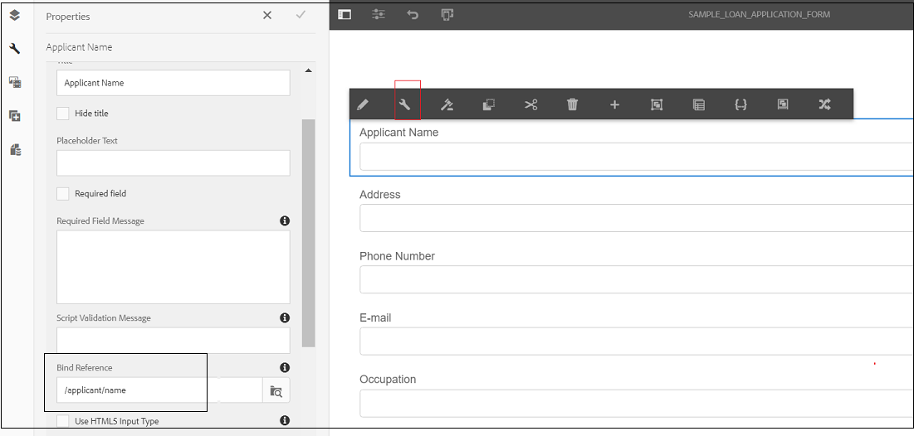
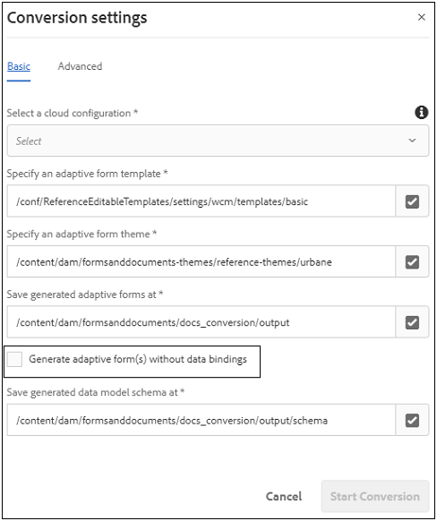

# Rekommenderad ifyllning baserad på datakälla och skicka in arbetsflöden för anpassningsbara formulär {#recommended-data-source-btased-prefill-and-submit-workflows-for-adaptive-forms}

Du kan använda någon av följande datakällor med adaptiva formulär som har konverterats med tjänsten Automated forms conversion:

* Formulärdatamodell, OData eller någon annan tredjepartstjänst
* JSON-schema
* XSD-schema

Baserat på datakällan kan du välja att generera ett anpassningsbart formulär med eller utan en datamodell.

I den här artikeln beskrivs de rekommenderade arbetsflödena för att förifylla fältvärden och skicka-alternativ efter att du har valt en datakälla och genererat ett anpassat formulär med hjälp av konverteringstjänsten.

<table> 
 <tbody> 
  <tr> 
   <th><strong>Datakälla</strong></th> 
   <th><strong>Rekommenderat arbetsflöde</strong></th> 
  </tr> 
  <tr> 
   <td><p>Formulärdatamodell, OData eller någon annan tredjepartstjänst</p></td> 
   <td> 
    <p><strong>Alternativ 1</strong>: Du väljer formulärdatamodell, OData eller någon annan tredjepartstjänst som datakälla. Du <a href="#generate-adaptive-forms-with-no-data-binding">generera ett anpassat formulär utan databindning</a> med tjänsten Automated forms conversion. Du binder adaptiva formulärfält till formulärdatamodellenheter manuellt och använder alternativet för förifyllningstjänst för formulärdatamodell för att fylla i fältvärden i förväg. Du använder alternativet Skicka med formulärdatamodell för att skicka det adaptiva formuläret.</p></td> 
  </tr>
  <tr> 
   <td></td> 
   <td> 
   <p><strong>Alternativ 2</strong>: Du väljer formulärdatamodell, OData eller någon annan tredjepartstjänst som datakälla. Du <a href="#generate-adaptive-forms-with-no-data-binding">generera ett anpassat formulär utan databindning</a> med tjänsten Automated forms conversion. Du binder de adaptiva formulärfälten med regelredigeraren till förifyllda fältvärden. Ändra fältvärdena, om det behövs, och skicka data till crx-databasen.</p>
    </td> 
  </tr>
  <tr> 
   <td></td> 
   <td> 
    <p>Stegvisa instruktioner för hur du kör dessa arbetsflöden finns i <a href="#sqldatasource">Använd databas, OData eller någon tredjepartstjänst som datakälla.</a></p> </td> 
  </tr>
  <tr>
  <td><p>JSON-schema</p></td> 
   <td> 
    <p>Du väljer JSON-schema som datakälla. Baserat på den valda datakällan:</p></td> 
  </tr>
  <tr>
  <td></td> 
   <td> 
    <p><strong>Alternativ 1</strong>: Du <a href="#generate-adaptive-forms-with-no-data-binding">generera ett anpassat formulär utan databindning</a> använda tjänsten Automated forms conversion och konfigurera JSON-schemat som datakälla. Du binder adaptiva formulärfält till JSON-schemat manuellt och <a href="https://helpx.adobe.com/experience-manager/6-5/forms/using/prepopulate-adaptive-form-fields.html#Supportedprotocolsforprefillinguserdata" target="_blank">använda något av de protokoll som stöds</a> till förifyllda fältvärden. Ändra fältvärdena, om det behövs, och skicka data till crx-databasen.</p></td> 
  </tr>
  <tr>
  <td></td> 
   <td> 
    <p>Stegvisa instruktioner för hur du kör arbetsflödena finns i <a href="#jsondatasource">Använd JSON-schema som datakälla.</p></td> 
  </tr>
  <tr>
  <td></td> 
   <td> 
    <p><strong>Alternativ 2</strong>: Du <a href="#generate-adaptive-forms-with-json-binding">generera ett anpassningsbart formulär med JSON-databindning</a> med tjänsten Automated forms conversion. Förifyllningstjänsten och funktionen för att skicka formulär fungerar smidigt. Du behöver inte utföra några konfigurationssteg.</p> </td> 
  </tr>
   <tr>
  <td></td> 
   <td> 
    <p>Stegvisa instruktioner för hur du kör arbetsflödena finns i <a href="#jsonwithdatabinding">Använd JSON-schema som datakälla.</a></p> </td> 
  </tr>
  <tr>
  <td><p>XSD-schema</p></td> 
   <td> 
    <p>Du väljer XSD-schema som datakälla. Baserat på den valda datakällan kan du <a href="#generate-adaptive-forms-with-no-data-binding">generera ett anpassat formulär utan databindning</a> med tjänsten Automated forms conversion och konfigurera XSD-schemat som datakälla. Du binder de adaptiva formulärfälten till XSD-schemat manuellt och <a href="https://helpx.adobe.com/experience-manager/6-5/forms/using/prepopulate-adaptive-form-fields.html#Supportedprotocolsforprefillinguserdata" target="_blank">använda något av de protokoll som stöds</a> till förifyllda fältvärden. Ändra fältvärdena, om det behövs, och skicka data till crx-databasen.</p>
    </td> 
  </tr>
  <tr>
  <td></td> 
   <td> 
    <p>Stegvisa instruktioner för hur du kör arbetsflödena finns i <a href="#xsddatasource">Använd XSD-schema som datakälla.</a></p>
    </td> 
  </tr>
 </tbody> 
</table>


Mer information om tjänsten Automated forms conversion finns i följande artiklar:

* [Introduktion till den automatiserade konverteringstjänsten för formulär](introduction.md)
* [Konfigurera den automatiserade konverteringstjänsten för formulär](configure-service.md)
* [Konvertera utskriftsformulär till anpassningsbara formulär](convert-existing-forms-to-adaptive-forms.md)
* [Granska och korrigera konverterade formulär](review-correct-ui-edited.md)

Informationen i den här artikeln bygger på antagandet att alla som läser den har grundläggande kunskaper i adaptiva formulärkoncept.

## Krav {#pre-requisites}

* Konfigurera en [AEM författarinstans](https://helpx.adobe.com/experience-manager/6-5/sites/deploying/using/deploy.html)
* Konfigurera [automated forms conversion på AEM författarinstans](configure-service.md)

## Exempel på anpassningsbart formulär {#sample-adaptive-form}

Om du vill köra användningsexemplen för att förifylla fältvärden i ett adaptivt formulär och skicka dem till datakällan hämtar du följande exempelfil i PDF.

Exempelblankett för låneansökan

[Hämta fil](assets/sample_loan_application_form.pdf)

Filen PDF fungerar som indata till tjänsten Automated forms conversion. Tjänsten konverterar den här filen till ett anpassat formulär. Följande bild visar låneansökan i PDF-format.


## Förbered data för formulärmodellen {#prepare-data-for-form-model}

Med AEM Forms dataintegrering kan du konfigurera och ansluta till olika datakällor. När du har genererat ett anpassat formulär med konverteringsprocessen kan du definiera formulärmodellen baserat på en formulärdatamodell, XSD eller ett JSON-schema. Du kan använda en databas, Microsoft Dynamics eller någon annan tredjepartstjänst för att skapa en formulärdatamodell.

I den här självstudien används MySQL-databasen som källa för att skapa en formulärdatamodell. Skapa en **lånprogram** schema i databasen och lägg till en **sökande** till schemat baserat på de fält som är tillgängliga i det adaptiva formuläret.


Du kan använda följande DDL-programsats för att skapa **sökande** tabellen i databasen.

```sql
CREATE TABLE `applicant` (
   `name` varchar(45) DEFAULT NULL,
   `address` varchar(45) DEFAULT NULL,
   `phonenumber` int(11) NOT NULL,
   `email` varchar(45) DEFAULT NULL,
   `occupation` varchar(45) DEFAULT NULL,
   `annualsalary` varchar(45) DEFAULT NULL,
   `familymembers` int(11) DEFAULT NULL,
   PRIMARY KEY (`phonenumber`)
 ) ENGINE=InnoDB DEFAULT CHARSET=utf8
```

Om du använder ett XSD-schema som formulärmodell för att köra användningsexemplen skapar du en XSD-fil med följande text:

```xml
<?xml version="1.0" encoding="utf-8" ?>
    <xs:schema targetNamespace="http://adobe.com/sample.xsd"
                    xmlns="http://adobe.com/sample.xsd"
                    xmlns:xs="http://www.w3.org/2001/XMLSchema">

<xs:element name="sample" type="SampleType"/>

  <xs:complexType name="SampleType">
    <xs:sequence>
      <xs:element name="name" type="xs:string"/>
   <xs:element name="address" type="xs:string"/>
   <xs:element name="phonenumber" type="xs:int"/>
   <xs:element name="email" type="xs:string"/>
   <xs:element name="occupation" type="xs:string"/>
   <xs:element name="annualsalary" type="xs:string"/>
   <xs:element name="familymembers" type="xs:string"/>
 </xs:sequence>
  </xs:complexType>

  </xs:schema>
```

Eller hämta XSD-schemat till det lokala filsystemet.

Exempel på XSD-schema för låneansökan

[Hämta fil](assets/loanapplication.xsd)

Mer information om hur du använder XSD-schema som formulärmodell i adaptiva formulär finns i [Skapa anpassningsbara formulär med XML-schema](https://helpx.adobe.com/experience-manager/6-5/forms/using/adaptive-form-xml-schema-form-model.html).

Om du använder ett JSON-schema som formulärmodell för att köra användningsfallen, skapar du en JSON-fil med följande text:

```JSON
{
    "$schema": "http://json-schema.org/draft-04/schema#",
    "definitions": {
        "loanapplication": {
            "type": "object",
            "properties": {
                "name": {
                    "type": "string"
                },
                "address": {
                    "type": "string"
                },
    "phonenumber": {
                    "type": "number"
                },
    "email": {
                    "type": "string"
                },
    "occupation": {
                    "type": "string"
                },
    "annualsalary": {
                    "type": "string"
                },
    "familymembers": {
                    "type": "number"
                }
            }
        }
 },
 "type": "object",
    "properties": {
        "employee": {
            "$ref": "#/definitions/loanapplication"
        }
    }
}
```

Eller hämta JSON-schemat till det lokala filsystemet.

Exempelschema för låneansökan - JSON

[Hämta fil](assets/demo_schema.json)

Mer information om hur du använder JSON-schema som formulärmodell i adaptiva formulär finns i [Skapa anpassningsbara formulär med JSON-schema](https://helpx.adobe.com/experience-manager/6-5/forms/using/adaptive-form-json-schema-form-model.html).

## Generera anpassningsbara formulär utan databindning {#generate-adaptive-forms-with-no-data-binding}

Använd [Tjänsten automated forms conversion som ska konverteras](convert-existing-forms-to-adaptive-forms.md) den [exempelformulär för låneansökan](#sample-adaptive-form) till en anpassningsbar form utan databindning. Se till att du väljer **[!UICONTROL Generate adaptive form(s) without data bindings]** om du vill generera ett anpassat formulär utan databindning.


När du har genererat ett anpassat formulär utan databindning väljer du en datakälla för det anpassningsbara formuläret:

* [Databas, OData eller någon tredjepartstjänst](#sqldatasource)
* [JSON-schema](#jsondatasource)
* [XSD-schema](#xsddatasource)

>[!NOTE]
> Om det adaptiva formuläret som du konverterar med tjänsten Automated forms conversion innehåller flera fält med samma namn, ska du se till att dessa fält är bundna till datakällenheter för att undvika eventuella dataförluster under överföringen.

### Använd databas, OData eller någon annan tjänst från tredje part som datakälla {#sqldatasource}

Användningsfall: Du genererar ett adaptivt formulär utan databindning med tjänsten Automated forms conversion och konfigurerar MYSQL-databasen som datakälla. Du binder adaptiva formulärfält till formulärdatamodellenheter manuellt och använder **[!UICONTROL Form Data Model Prefill Service]** för att fylla i fältvärden i förväg. Du använder **[!UICONTROL Submit using Form Data Model]** möjlighet att skicka in det anpassade formuläret.

Innan användningsexemplet körs:

* [Konfigurera MySQL-databasen som datakälla](https://helpx.adobe.com/experience-manager/6-5/forms/using/configure-data-sources.html#configurerelationaldatabase)
* [Skapa formulärdatamodellen](https://helpx.adobe.com/experience-manager/6-5/forms/using/work-with-form-data-model.html)

Baserat på användningsexemplet skapar du **lånprogram** formulärdatamodell och binda lästjänstargument till en **[!UICONTROL Literal]** värde. Det literala värdet för telefonnummer måste vara en av posterna som konfigurerats i **sökande** schema för MySQL-databasen. Tjänsterna använder värdet som argument för att hämta information från datakällan. Du kan också välja [Attribut eller attribut för användarprofil](https://helpx.adobe.com/experience-manager/6-5/forms/using/work-with-form-data-model.html#bindargument) från **[!UICONTROL Binding To]** nedrullningsbar lista


>[!NOTE]
>
>Se till att du lägger till **get** och **infoga** tjänster till formulärdatamodellen, konfigurera och testa tjänsterna innan användningsfallet körs.

Utför följande steg:

1. Markera de konverterade **exempelformulär för låneansökan** finns i **[!UICONTROL output]** mapp och tryck **[!UICONTROL Properties]**.
1. Tryck på **[!UICONTROL Form Model]** flik, välja **[!UICONTROL Form Data Model]** från **[!UICONTROL Select From]** nedrullningsbar lista och tryck **[!UICONTROL Select Form Data Model]** för att välja **lånprogram** formulärdatamodell. Tryck **[!UICONTROL Save & Close]** för att spara formuläret.
1. Välj **exempelformulär för låneansökan** och trycka **[!UICONTROL Edit]**.
1. I **[!UICONTROL Content]** trycker du på konfigurationsikonen:

   

   1. I **[!UICONTROL Basic]** avsnitt, markera **[!UICONTROL Form Data Model Prefill service]** från **[!UICONTROL Prefill Service]** nedrullningsbar lista.

   1. I **[!UICONTROL Submission]** avsnitt, markera **[!UICONTROL Submit using Form Data Model]** från **[!UICONTROL Submit Action]** nedrullningsbar lista.

   1. Markera datamodellen med **[!UICONTROL Data Model to submit]** fält.
   1. Tryck  för att spara egenskaperna.

1. Tryck på textrutan Sökandes namn och välj  (Konfigurera).

   1. I fältet Bindningsreferens väljer du **Sökande** > **Namn** och trycka  för att spara egenskaperna. Skapa på samma sätt en databindning för **Adress**, **Telefonnummer**, **E-post**, **Yrke**, **Årslön (i dollar)** och **Nej. av familjemedlemmar som är beroende av varandra** fält med formulärdatamodellenheter.

   

1. Tryck **[!UICONTROL Preview]** om du vill visa förfyllda värden för anpassade formulärfält.
1. Ändra fältvärdena, om det behövs, och skicka det anpassade formuläret. Fältvärdena skickas till MySQL-databasen. Du kan uppdatera **sökande** i databasen för att visa de uppdaterade värdena i tabellen.

**Användningsfall:** Du genererar ett adaptivt formulär utan databindning med tjänsten Automated forms conversion och konfigurerar MYSQL-databasen som datakälla. Du binder de adaptiva formulärfälten med regelredigeraren till förifyllda fältvärden. Ändra fältvärdena, om det behövs, och skicka data till crx-databasen.

Utför följande steg för att använda [regelredigerare](https://helpx.adobe.com/experience-manager/6-5/forms/using/rule-editor.html) anropa datamodelltjänst för formulär för att binda fält och förifyllda värden i ett anpassat formulär:

1. Välj **exempelformulär för låneansökan** i **[!UICONTROL output]** mapp och tryck **[!UICONTROL Edit]**.
1. I **[!UICONTROL Content]** trycker du på konfigurationsikonen:

   

   I **[!UICONTROL Basic]** avsnitt, markera **[!UICONTROL Form Data Model Prefill service]** från **[!UICONTROL Prefill Service]** nedrullningsbar lista.

1. Tryck på **[!UICONTROL Applicant Name]** textruta och tryck **[!UICONTROL Edit Rules]**.

   

1. Tryck **[!UICONTROL Create]** på regelredigeringssidan.
1. På **[!UICONTROL Rule Editor]** sida:

   1. Välj ett tillstånd för textrutan Sökandes namn. Till exempel: **[!UICONTROL is initialized]**, vilket leder till att **[!UICONTROL Then]** villkor när du återger formuläret i **[!UICONTROL Preview]** läge.

   1. I **[!UICONTROL Then]** avsnitt, markera **[!UICONTROL Invoke Service]** från **[!UICONTROL Select Action]** nedrullningsbar lista. Alla tjänster på din Forms-instans visas i listrutan.

   1. Välj en **[!UICONTROL Get]** från avsnittet med formulärdatamodeller. Indatafältet visas **telefonnummer**, som är primärnyckeln som definieras för **sökande** datamodell. Systemet hämtar och fyller i förväg i värdena i det anpassade formuläret för fält i utdataavsnittet baserat på det här fältet.

   1. Skapa en bindning för anpassade formulärfält med formulärdatamodellenheter med hjälp av avsnittet Utdata. Bindning **[!UICONTROL Applicant Name]** anpassat formulärfält med **name** enhet.

   1. Tryck på **[!UICONTROL Done]**. Tryck **[!UICONTROL Done]** igen på sidan Regelredigeraren.

   

1. Tryck **[!UICONTROL Preview]** om du vill visa förfyllda värden för anpassade formulärfält.

   >[!NOTE]
   >
   >Se till att **[!UICONTROL Return Array]** Egenskapen är AV för **get** service-egenskap i formulärdatamodellen som är kopplad till det adaptiva formuläret.

1. Ändra fältvärdena, om det behövs, och skicka det anpassade formuläret. De data som skickas finns på följande plats i crx-databasen:

   `http://host name:port/crx/de/index.jsp#/content/forms/fp/admin/submit/data/latest file available in the folder`

### Använd JSON-schema som datakälla {#jsondatasource}

**Användningsfall:** Du genererar ett adaptivt formulär utan databindning med tjänsten Automated forms conversion och konfigurerar JSON-schemat som datakälla. Du binder de adaptiva formulärfälten till JSON-schemat manuellt och använder **Förhandsgranska med data** för att fylla i fältvärden i förväg. Ändra fältvärdena, om det behövs, och skicka data till crx-databasen.

Kontrollera att du har:

* [ett giltigt JSON-schema som är kompatibelt med JSON-schemastrukturen](#prepare-data-for-form-model)
* [ett anpassningsbart formulär utan databindning](#generate-adaptive-forms-with-no-data-binding)

Utför följande steg:

1. Markera de konverterade **exempelformulär för låneansökan** finns i **output** mapp och tryck **[!UICONTROL Properties]**.
1. Tryck på **[!UICONTROL Form Model]** flik, välja **[!UICONTROL Schema]** från **[!UICONTROL Select From]** nedrullningsbar lista och tryck **[!UICONTROL Select Schema]** för att överföra **demo.schema JSON** schemat har sparats i det lokala filsystemet. Tryck **[!UICONTROL Save & Close]** för att spara formuläret.
1. Välj **exempelformulär för låneansökan** och trycka **[!UICONTROL Edit]**.
1. Tryck på textrutan Sökandes namn och välj  (Konfigurera).

   I fältet Bindningsreferens väljer du **Sökande** > **Namn** och trycka  för att spara egenskaperna. Skapa på samma sätt en databindning för **Adress**, **Telefonnummer**, **E-post**, **Yrke**, **Årslön (i dollar)** och **Nej. av familjemedlemmar som är beroende av varandra** fält med JSON-schemaentiteter.

1. Markera de konverterade **exempelformulär för låneansökan** finns i **[!UICONTROL output]** mapp igen och välj **[!UICONTROL Preview]** > **[!UICONTROL Preview with Data]**.</br>

   Hämta exempeldatafil</br>

   [Hämta fil](assets/json_data_file.txt)</br>

1. Ändra fältvärdena, om det behövs, och skicka det anpassade formuläret. De data som skickas finns på följande plats i crx-databasen:

   `http://host name:port/crx/de/index.jsp#/content/forms/fp/admin/submit/data/latest file available in the folder`

### Använd XSD-schema som datakälla {#xsddatasource}

**Användningsfall:** Du genererar ett adaptivt formulär utan databindning med tjänsten Automated forms conversion och konfigurerar XSD-schemat som datakälla. Du binder de adaptiva formulärfälten till XSD-schemat manuellt och använder **Förhandsgranska med data** till förifyllda fältvärden. Ändra fältvärdena, om det behövs, och skicka data till crx-databasen.

Kontrollera att du har:

* [ett giltigt XSD-schema som är kompatibelt med XML-schemastrukturen](#prepare-data-for-form-model)
* [ett anpassningsbart formulär utan databindning](#generate-adaptive-forms-with-no-data-binding)

Utför följande steg:

1. Markera de konverterade **exempelformulär för låneansökan** finns i **[!UICONTROL output]** mapp och tryck **[!UICONTROL Properties]**.
1. Tryck på **[!UICONTROL Form Model]** flik, välja **[!UICONTROL Schema]** från **[!UICONTROL Select From]** nedrullningsbar lista och tryck **[!UICONTROL Select Schema]** för att överföra **lånprogram** XSD-schema har sparats i det lokala filsystemet. Välj rotelementet för XSD-schemat och tryck på **[!UICONTROL Save & Close]** för att spara formuläret.
1. Välj **exempelformulär för låneansökan** och trycka **[!UICONTROL Edit]**.
1. Tryck på textrutan Sökandes namn och välj  (Konfigurera).
I fältet Bindningsreferens väljer du **Sökande** > **Namn** och trycka  för att spara egenskaperna. Skapa på samma sätt en databindning för **Adress**, **Telefonnummer**, **E-post**, **Yrke**, **Årslön (i dollar)** och **Nej. av familjemedlemmar som är beroende av varandra** fält med XSD-schemaentiteter.

1. Markera de konverterade **exempelformulär för låneansökan** finns i **output** mapp igen och välj **[!UICONTROL Preview]** > **[!UICONTROL Preview with Data]**.</br>

   Hämta exempeldatafil</br>

   [Hämta fil](assets/loan-application-data-xml-data.zip)</br>


1. Ändra fältvärdena, om det behövs, och skicka det anpassade formuläret. De data som skickas finns på följande plats i crx-databasen:

   `http://host name:port/crx/de/index.jsp#/content/forms/fp/admin/submit/data/latest file available in the folder`

## Generera anpassningsbara formulär med JSON-bindning {#generate-adaptive-forms-with-json-binding}

Använd [Tjänsten automated forms conversion som ska konverteras](convert-existing-forms-to-adaptive-forms.md) den [exempelformulär för låneansökan](#sample-adaptive-form) till en anpassningsbar form med databindning. Se till att du inte väljer **[!UICONTROL Generate adaptive form(s) without data bindings]** när du genererar det anpassade formuläret.



### Använd JSON-schema som datakälla {#jsonwithdatabinding}

**Användningsfall:** Du genererar ett anpassningsbart formulär med JSON-databindning med hjälp av tjänsten Automated forms conversion. Förifyllningstjänsten och funktionen för att skicka formulär fungerar smidigt. Du behöver inte utföra några konfigurationssteg.

Kontrollera att du har [ett anpassningsbart formulär med databindning](#generate-adaptive-forms-with-json-binding).

Utför följande steg:

1. Markera de konverterade **exempelformulär för låneansökan** finns i **[!UICONTROL output]** mapp igen och välj **[!UICONTROL Preview]** > **[!UICONTROL Preview with Data]**.</br>

   Hämta exempeldatafil</br>

   [Hämta fil](assets/loan_application_data_source_json_data_binding.txt)</br>

1. Ändra fältvärdena, om det behövs, och skicka det anpassade formuläret. De data som skickas finns på följande plats i crx-databasen:

   `http://host name:port/crx/de/index.jsp#/content/forms/fp/admin/submit/data/latest file available in the folder`

## Konvertera inskickade JSON-data från adaptiva formulär till XML-format {#convert-submitted-adaptive-form-data-to-xml}

När du anger värden i anpassningsbara formulärfält och skickar dem är data tillgängliga i JSON-format i crx-databasen. Du kan konvertera formatet JSON-data till XML med hjälp av [org.apache.sling.Commons.json.xml](https://sling.apache.org/apidocs/sling5/org/apache/sling/commons/json/xml/XML.html#toString) API eller följande exempelkod:

```
import org.apache.sling.commons.json.JSONException;
import org.apache.sling.commons.json.JSONObject;
import org.apache.sling.commons.json.xml.XML;
 
public class ConversionUtils {
 
    public static String jsonToXML(String jsonString) throws JSONException {
        //https://sling.apache.org/apidocs/sling5/org/apache/sling/commons/json/xml/XML.html#toString(java.lang.Object)
        //jar - http://maven.ibiblio.org/maven2/org/apache/sling/org.apache.sling.commons.json/2.0.18/
        //Note: Need to extract boundData part before converting to XML
        return XML.toString(new JSONObject(jsonString));
    }
}
```
