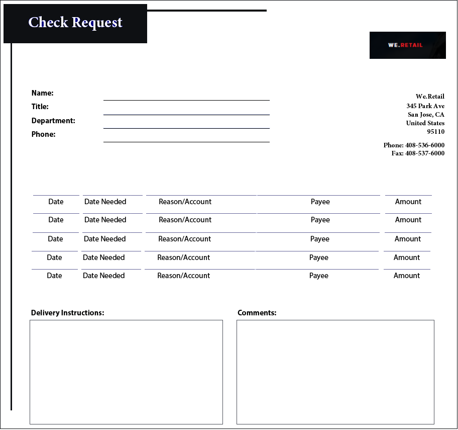
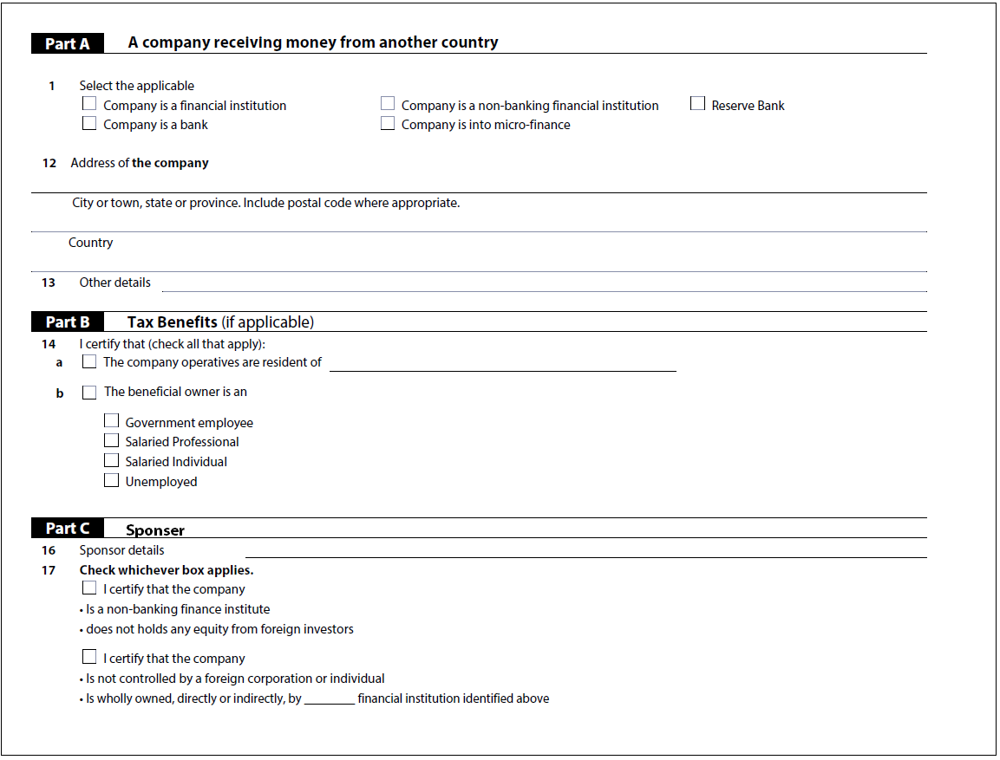

# Bästa praxis och kända komplexa mönster {#Best-practices-and-considerations2}

Det här dokumentet innehåller riktlinjer och rekommendationer som formuläradministratörer, författare och utvecklare kan dra nytta av när de arbetar med tjänsten Automated Forms Conversion. Här diskuteras bästa praxis direkt från att förbereda källformulär till att korrigera komplexa mönster som kräver extra arbete för automatiserad konvertering. Dessa bästa metoder bidrar tillsammans till prestanda och resultat i tjänsten Automated Forms Conversion.

## Bästa praxis

Konverteringstjänsten konverterar PDF-formulär som finns i AEM Forms-instansen till adaptiva formulär. Du kan överföra alla PDF-formulär samtidigt eller i faser efter behov. Tänk på följande innan du laddar upp formulären:

* Behåll antalet formulär i en mapp under 15 och behåll det totala antalet sidor i en mapp under 50.
* Behåll mappstorleken mindre än 10 MB. Behåll inte formulär i en undermapp.
* Behåll antalet sidor i ett formulär under 15.
* Överför inte skyddade formulär. Tjänsten konverterar inte lösenordsskyddade och skyddade formulär.
* Do not upload the [PDF Portfolios](https://helpx.adobe.com/acrobat/using/overview-pdf-portfolios.html). Tjänsten konverterar inte en PDF-portfolio till anpassningsbara formulär.
* Ladda inte upp inskannade formulär, formulär med färg, formulär som inte är på engelska eller ifyllda formulär. Sådana formulär stöds inte.
* Ladda inte upp källformulär med blanksteg i filnamnet. Ta bort utrymmet från filnamnet innan du överför formulären.
* Använd adaptiva formulärmallar för att ange sidhuvud och sidfot för det anpassningsbara utdataformuläret. Tjänsten ignorerar sidhuvud-fot i PDF-källdokument och använder sidhuvud-fot som anges i den adaptiva formulärmallen.

## Lär känna komplexa mönster

AEM Forms automatiserade konverteringstjänst använder artificiell intelligens och algoritmer för maskininlärning för att förstå källformulärets layout och fält. Alla maskininlärningstjänster lär sig kontinuerligt av källdata och skapar bättre resultat vid varje förändring. Dessa tjänster lär sig av upplevelser som människor.

Tjänsten Automated Forms Conversion har utbildats i en stor uppsättning formulär. Den identifierar enkelt fält i ett källformulär och skapar anpassningsbara formulär. Det finns emellertid vissa fält och format i PDF-formulär som är lätta att se för det mänskliga ögat men svåra att förstå för tjänsten. Tjänsten kan tilldela vissa fält eller format andra än tillämpliga fälttyper eller paneler. Alla sådana fält- och formatmönster listas nedan.

Tjänsten börjar identifiera och tilldela rätt fält eller paneler till dessa mönster när den lär sig av källdata. Just nu kan du använda [Gransknings- och Korrigera](review-correct-ui-edited.md) -redigeraren för att korrigera sådana problem. Innan du börjar åtgärda problemen eller läser mer bör du bekanta dig med [adaptiva formulärkomponenter](https://helpx.adobe.com/experience-manager/6-5/forms/using/introduction-forms-authoring.html).

### Allmänna mönster {#general}

| Mönster | Exempel |
|--- |--- |
| **Mönstertjänsten**  konverterar inte färgade PDF-formulär till anpassningsbara formulär.   **Upplösning **Använd PDF-formulär i svartvitt eller gråskala . |  |
| **Pattern**  Service konverterar inte ifyllda PDF-formulär till anpassningsbara formulär.   **Upplösning ** Använd tomma adaptiva formulär. |  |
| **Mönstertjänsten**  kan inte identifiera text och fält i tätt format.   **Upplösning ** Öka bredden mellan text och fält i ett kompakt formulär innan konverteringen startar. |  |
| **Pattern**  Service stöder inte skannade formulär.   **Upplösning **Använd inte skannade formulär. |  |
| **Pattern**  Service extraherar inte bilder och text i bilder.   **Upplösning **Lägg till bilder eller text i konverterade formulär manuellt . |  |
| **Mönstertabeller** med  prickade eller otydliga gränser och kanter konverteras inte.   **Upplösning ** Använd tabeller med tydliga gränser och kanter. stöds. |  |
| **Mönster** med adaptiv   form stöder inte lodrät text från rutan. Tjänsten konverterar alltså inte lodrät text till motsvarande text i adaptiva formulär.   **Upplösning ** Använd adaptiv formulärredigerare för att lägga till lodrät text, om det behövs. |  |

### Urvalsgrupp {#choice-group}

| Mönster | Upplösning |
|--- |--- |
| **Alternativ för mönsteralternativgrupper**   med andra former än rutor och cirklar konverteras inte till motsvarande adaptiva formulärkomponenter.   **Upplösning ** Ändra former för alternativ till ruta eller cirkel eller använd Gransknings- och korrigeringsredigeraren för att identifiera formerna. |  |

### Form fields {#form-fields}

| Mönster | Upplösning |
|--- |--- |
| **Mönstertjänsten** identifierar   inte fält utan tydliga kantlinjer.   **Upplösning ** Använd redigeraren Granska och Korrigera för att identifiera sådana fält. |  |
| **Mönstertjänsten**   kan inte identifiera vissa formulärfält för urvalsgrupper med beskrivningar längst ned eller till höger i ett formulär.   **Upplösning **Använd gransknings- och korrigeringsredigeraren för att identifiera sådana fält |  |
| **Mönstertjänsten**   sammanfogar eller tilldelar fel typ till vissa formulärfält som är placerade mycket nära varandra eller som inte har några tydliga kantlinjer.   **Upplösning ** Använd redigeraren Granska och Korrigera för att identifiera sådana fält. |  |
| **Mönstertjänsten**  kan inte identifiera fält med långt borta bildtexter eller en prickad linje mellan bildtexten och inmatningsfältet.   **Upplösning ** Använd formulärfält med tydliga gränser eller använd Gransknings- och korrigeringsredigeraren för att åtgärda sådana problem. |  |

### Listor {#lists}

| Mönster | Upplösning |
|--- |--- |
| **Mönsterlistor** som innehåller  formulärfält sammanfogas eller konverteras inte till motsvarande adaptiva formulärkomponenter   **Upplösning ** . Använd formulärfält med tydliga gränser eller använd Gransknings- och Korrigeringsredigerare för att korrigera sådana problem. |  |
| **Mönstertjänsten**  kan lämna några inkapslade listor med oidentifierad   **upplösning ** . Använd Gransknings- och korrigeringsredigeraren för att åtgärda problemen. |  |
| **Mönstertjänsten** sammanfogar vissa listor som innehåller urvalsgrupper med varandra   Upplösning   **** . Använd Gransknings- och Korrigera-redigeraren för att åtgärda problemen. |  |

<!--
Comment Type: draft

<h3>Choice groups</h3>
-->

<!--
Comment Type: draft

<ul>
<li>Lists with form fields, nested lists, and nested choice groups are not supported.</li>
<li>Form fields with captions at bottom or right are not supported.</li>
<li>Form fields without borders are not supported.</li>
<li>Hidden form fields are not supported.</li>
<li>Button in PDF forms are not converted to adaptive form buttons.  </li>
<li>Tables with clear explicit boundaries and borders are supported.</li>
<li>Fields with far away captions are not supported.  </li>
<li>Choice groups with only box or circle shaped selectors are supported. </li>
</ul>
-->
