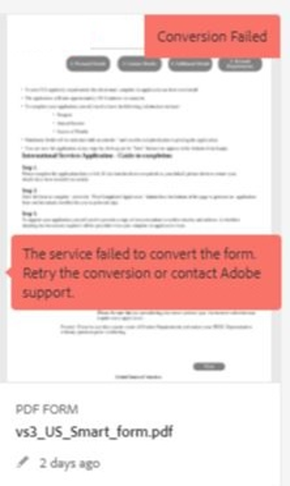
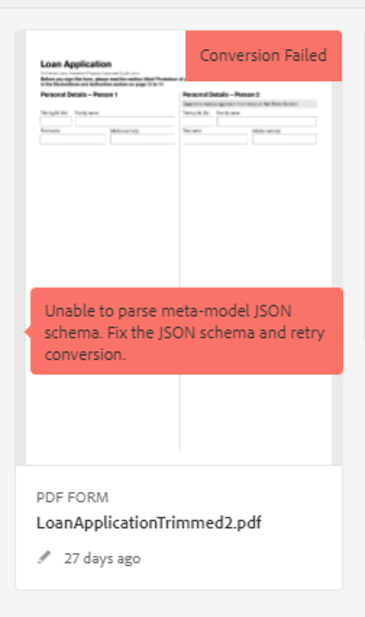

# Felsöka automatisk formulärkonverteringstjänst

Dokumentet innehåller grundläggande felsökningssteg för vanliga fel.

<!--The article provides information on installation, configuration and administration issues that may arise in an Automated Forms Conversion Service production environment. -->

## Vanliga fel {#commonerrors}

| Fel | Exempel |
|--- |--- |
| **Felmeddelande**   Åtkomsttokenhuvudet är inte tillgängligt.    **Orsak** till att   en administratör har skapat flera IMS-konfigurationer eller att IMS-konfigurationen inte kan nå AFCS-tjänsten på Adobe Cloud.   **Upplösning ** Om det finns flera konfigurationer tar du bort alla konfigurationer och[skapar en ny konfiguration](configure-service.md#obtainpubliccertificates). Om det finns en enda konfiguration använder du** Hälsokontroll **för att[kontrollera anslutningen](configure-service.md#createintegrationoption). |  |
| **Felmeddelande**   Det gick inte att ansluta till tjänsten.    **Orsak ** till felaktig tjänst-URL eller ingen tjänst-URL anges i molntjänsterna för automatisk formulärkonvertering.  **URL** för   tjänsten [Korrigera upplösning](configure-service.md#configure-the-cloud-service) i molntjänster för automatisk formulärkonvertering. |  |
| **Felmeddelande**   Tjänsten kunde inte konvertera formuläret.    **Orsak **till att nätverksanslutningsproblem uppstår när du avslutar tjänsten på grund av planerat underhåll eller driftstopp i Adobe Cloud.  **Upplösning**   Lös problem med nätverksanslutningen när du är klar och kontrollera statusen för tjänsten på https://status.adobe.com/ för ett planerat eller oplanerat avbrott. |  |
| **Felmeddelande**   Antalet sidor är fler än 15.    **Orsak **till att källformuläret är längre än 15 sidor.  **Upplösning**   Använd Adobe Acrobat för att dela upp formulär med mer än 15 sidor. Använd färre än 15 sidor i ett formulär. |  |
| **Felmeddelande**   Antalet filer är fler än 15.    **Orsak ** : Mappen innehåller fler än 15 formulär.  **Upplösning** Använd   15 för att ställa in antalet formulär i en mapp. Det totala antalet sidor i en mapp är mindre än 50. Minska mappens storlek till mindre än 10 MB. Behåll inte formulär i en undermapp. Organisera källformulären i en batch på 8-15 formulär. |  |
| **Felmeddelande**   Källfilformatet stöds inte.    **Orsak ** : Mappen som innehåller källformulär har filer som inte stöds.  **Upplösning**   Tjänsten stöder bara .xdp- och .pdf-filer. Ta bort filer med andra tillägg från mappen och kör konverteringen. |  |
| **Felmeddelande**  för skannade formulär stöds inte.    **Orsak ** : PDF-formuläret innehåller bara skannade bilder av formuläret och innehåller ingen innehållsstruktur.  **Upplösning**   Tjänsten stöder inte konvertering av skannade formulär eller en bild av ett formulär till ett anpassat, körklart formulär. Du kan dock använda Adobe Acrobat för att konvertera bilden av ett formulär till ett PDF-formulär. Använd sedan tjänsten för att konvertera PDF-formuläret till ett anpassat formulär. Använd alltid en högkvalitativ bild av formuläret för konvertering i Acrobat. Det förbättrar kvaliteten på konverteringen. |  |
| **Felmeddelandets** krypterade PDF-formulär   stöds inte.    **Orsak **: Mappen innehåller krypterade PDF-formulär.  **Upplösning**   Tjänsten stöder inte konvertering av krypterade PDF-formulär till adaptiva formulär. Ta bort krypteringen, ladda upp det okrypterade formuläret och kör konverteringen. |  |
| **Felmeddelande**   Det gick inte att parsa JSON-schema av metamodell.    **Orsak ** till att JSON-schemat som tillhandahålls till tjänsten inte är korrekt formaterat, innehåller ogiltiga tecken eller använder ogiltig syntax för att mappa komponenter.  **Upplösning** Kontrollera   JSON-filens formatering. Du kan använda valfri JSON-validerare online för att kontrollera schemats formatering och struktur. Mer information om metamodellsyntax finns i [Utöka artikeln med metamodellen](extending-the-default-meta-model.md) som standard. |  |

<!--

<table>
<thead>
<tr>
<th>Error</th>
<th>Example</th>
</tr>
</thead>
<tbody>
<tr>
<td><strong>Error Message</strong> 
 The access token header is not available. 
 <strong>Reason</strong>   An administrator has created multiple IMS configurations or IMS configuration is not able to reach AFCS service on Adobe Cloud.   <strong>Resolution</strong>   If there are multiple configurations, delete all the configurations and <a href="configure-service.md#obtainpubliccertificates">create a new configuration</a>.   If there is a single configuration, use <strong> Health Check </strong> to <a href="configure-service.md#createintegrationoption">check connectivity</a>.</td>
<td></td>
</tr>
<tr>
<td><strong>Error Message</strong>   Unable to connect to the service.    <strong>Reason</strong>   Incorrect service URL or no service URL is mentioned in Automated Forms Conversion Service cloud services.   <strong>Resolution</strong>   Correct <a href="configure-service.md#configure-the-cloud-service">Service URL</a> in Automated Forms Conversion Service Cloud services.</td>
<td></td>
</tr>
<tr>
<td><strong>Error Message</strong>   The service failed to convert the form.    <strong>Reason</strong>   Network connectivity issues at your end, the service is down due to scheduled maintenance, or outage on Adobe Cloud.   <strong>Resolution</strong>   Resolve network connectivity issues at your end and check the status of the service on <a href="https://status.adobe.com/">https://status.adobe.com/</a> for a planned or unplanned outage.</td>
<td></td>
</tr>
<tr>
<td><strong>Error Message</strong>   The number of pages is more than 15.    <strong>Reason</strong>   The source form is more than 15 pages long.    <strong>Resolution</strong>   Use Adobe Acrobat to split forms with more than 15 pages. Bring the number of pages in a form to less than 15.</td>
<td></td>
</tr>
<tr>
<td><strong>Error Message</strong>   The number of files is more than 15.    <strong>Reason</strong>    The folder contains more than 15 forms.   <strong>Resolution</strong>   Bring the number of forms in a folder to less than or equal to 15. Bring the total number of pages in a folder less than 50. Bring the size of the folder to less than 10 MB. Do not keep forms in a sub-folder. Organize source forms into a batch of 8-15 forms.</td>
<td></td>
</tr>
<tr>
<td><strong>Error Message</strong>   The source file format is not supported.    <strong>Reason</strong>   The folder containing source forms have some unsupported files.   <strong>Resolution</strong>   The service supports only .xdp and .pdf files. Remove files with any other extension from the folder and run the conversion.</td>
<td></td>
</tr>
<tr>
<td><strong>Error Message</strong>   Scanned forms are not supported.    <strong>Reason</strong>   The PDF form contains only scanned images of the form and contains no content structure.   <strong>Resolution</strong>   The service does not support converting scanned forms or an image of a form to an adaptive out-of-the-box. However, you use Adobe Acrobat to convert the image of a form to a PDF Form. Then, use the service to convert the PDF Form to an adaptive form. Always use a high-quality image of the form for conversion in Acrobat. It improves the quality of the conversion.</td>
<td></td>
</tr>
<tr>
<td><strong>Error Message</strong>   Encrypted PDF form is not supported.    <strong>Reason</strong>   The folder contains encrypted PDF forms.   <strong>Resolution</strong>   The service does not support converting an encrypted PDF form to an adaptive form. Remove the encryption, upload the non-encrypted form, and run the conversion.</td>
<td></td>
</tr>
<tr>
<td><strong>Error Message</strong>   Unable to parse meta-model JSON schema.    <strong>Reason</strong>   The JSON schema supplied to the service is not properly formatted, contains invalid characters, or uses invalid syntax to map components.    <strong>Resolution</strong>   Check the formatting of the JSON file. You can use any online JSON validator to check the formatting and structure of the schema. See, <a href="extending-the-default-meta-model.md">Extend the default meta-model</a> article for information on meta-model syntax.</td>
<td></td>
</tr>
</tbody>
</table>
-->