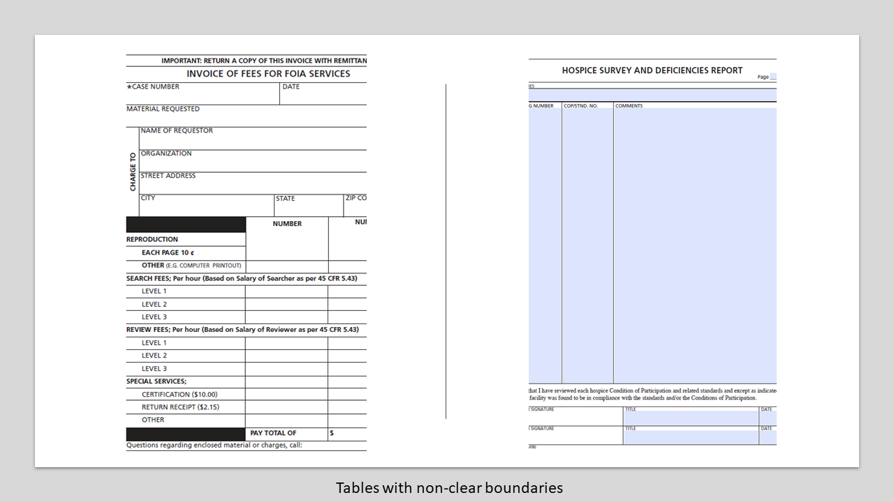
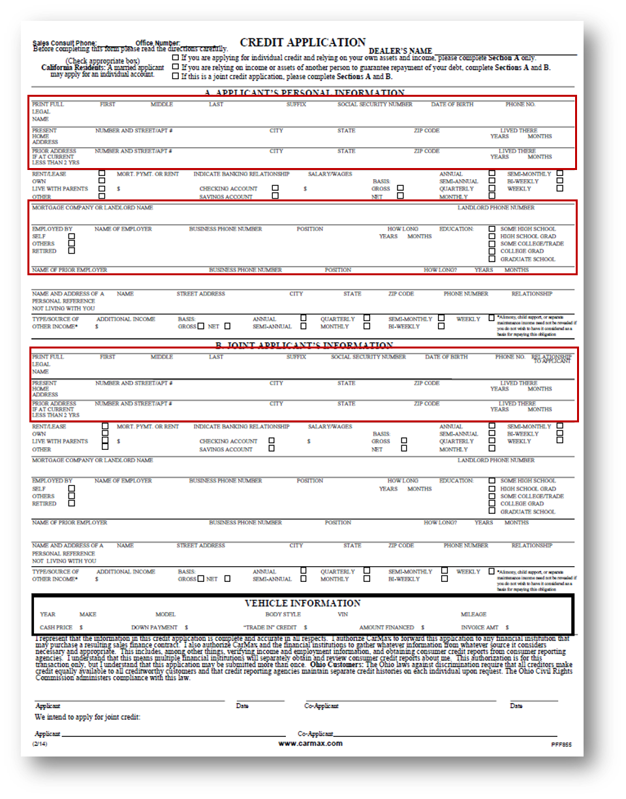
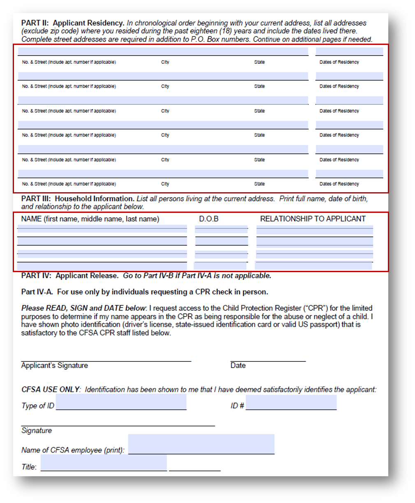
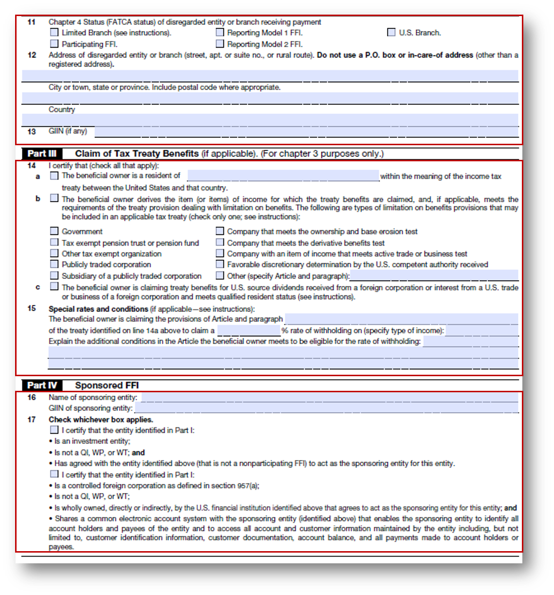
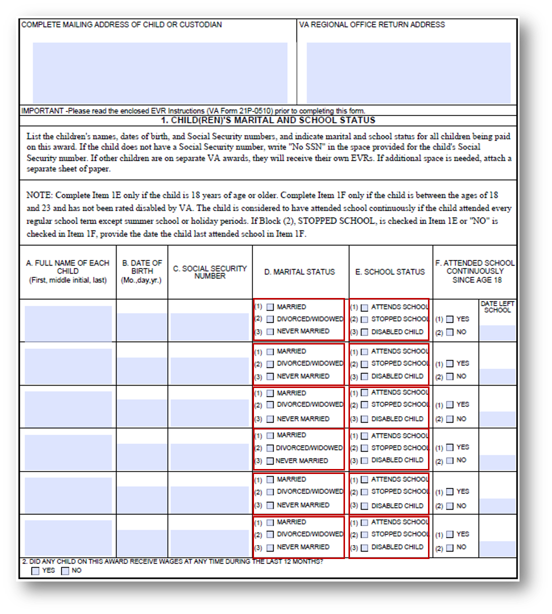

# Bästa praxis och överväganden {#do-not-publish-best-practices-and-considerations}

<!--
[DO NOT PUBLISH]
-->

AEM Forms tjänst för automatisk konvertering konverterar ett PDF-formulär till ett anpassningsbart formulär. Tjänsten använder artificiell intelligens och maskininlärningsalgoritmer för att förstå källformulärets layout och fält. Alla maskininlärningstjänster lär sig kontinuerligt av källdata och skapar bättre resultat vid varje förändring. Dessa tjänster lär sig av upplevelser som människor.

Automated forms conversion-tjänsten (AFCS) har utbildats på ett stort antal formulär. Den identifierar enkelt fält i ett källformulär och skapar anpassningsbara formulär. Det finns dock vissa fält och format i PDF forms som är lätta att se för det mänskliga ögat men svåra att förstå för tjänsten. Tjänsten kan tilldela vissa fält eller format andra än tillämpliga fälttyper eller paneler. Alla sådana fält- och formatmönster listas nedan.

Tjänsten börjar identifiera och tilldela rätt fält eller paneler till dessa mönster när den lär sig av källdata. Du kan använda [Granska och korrigera](review-correct-ui-edited.md) för att åtgärda sådana problem. Innan du börjar åtgärda problemen eller läser mer, bekanta dig med [adaptiva formulärkomponenter](https://helpx.adobe.com/experience-manager/6-5/forms/using/introduction-forms-authoring.html).

## Allmänt {#general}

<table border="1" cellpadding="1" cellspacing="0" style="border-collapse: separate; border-spacing: 0px;" width="100%"> 
 <tbody>
  <tr>
   <td width="30%">Kända mönster och upplösning</td> 
   <td width="70%">Exempel</td> 
  </tr>
   <td>
<strong>Mönster</strong>
 
Tjänsten konverterar inte ifyllt PDF forms till anpassningsbara formulär.
 
 
 
<strong>Upplösning</strong>
 
Använd tomma adaptiva formulär.
 </td> 
   <td style="text-align: left;"></td> 
  </tr>
  <tr>
   <td>
<strong>Mönster</strong>
 
Tjänsten kan inte identifiera text och fält i tätt format.
 
 
 
<strong>Upplösning</strong>
 
Öka bredden mellan text och fält i ett kompakt formulär innan konverteringen startar.
 </td> 
   <td style="text-align: left;"></td> 
  </tr>
  <tr>
   <td>
<strong>Mönster</strong>
 
Tjänsten stöder inte skannade formulär.
 
 
 
<strong>Upplösning</strong>
 
Använd inte skannade formulär. 
 </td> 
   <td></td> 
  </tr>
  <tr>
   <td>
<strong>Mönster</strong>
 
Tjänsten extraherar inte bilder och text i bilder. 
 
 
 
<strong>Upplösning</strong>
 
Lägg till bilder eller text manuellt i konverterade formulär.
 </td> 
   <td></td> 
  </tr>
  <tr>
   <td>
<strong>Mönster</strong>
 
Tabeller med prickade eller otydliga gränser och kanter konverteras inte.
 
<strong>Upplösning</strong>
 
Använd tabeller med tydliga gränser och ramar. stöds.
 </td> 
   <td></td> 
  </tr>
 </tbody>
</table>

## Urvalsgrupp  {#choice-group}

<table border="1" cellpadding="1" cellspacing="0" width="100%"> 
 <tbody>
  <tr>
   <td width="30%">Mönster</td> 
   <td width="70%">Exempel</td> 
  </tr>
  <tr>
   <td>
<strong>Mönster</strong>
 
Alternativ för alternativgrupper med andra former än rutor och cirklar konverteras inte till motsvarande adaptiva formulärkomponenter. 
 
 
 
<strong>Upplösning</strong>
 
Ändra former för alternativ till ruta eller cirkel eller använd Gransknings- och korrigeringsredigeraren för att identifiera formerna.
 </td> 
   <td> </td> 
  </tr>
 </tbody>
</table>

## Formulärfält {#form-fields}

<table border="1" cellpadding="1" cellspacing="0" width="100%"> 
 <tbody>
  <tr>
   <td width="30%">Mönster</td> 
   <td width="70%">Exempel</td> 
  </tr>
  <tr>
   <td width="25%">
<strong>Mönster</strong>
 
Tjänsten identifierar inte fält utan tydliga gränser.
 
 
 
<strong>Upplösning</strong>
 
Använd Gransknings- och Korrigera-redigeraren för att identifiera sådana fält.
 
 
 
 
 </td> 
   <td width="50%">  </td> 
  </tr>
  <tr>
   <td>
<strong>Mönster</strong>
 
Tjänsten lämnar vissa formulärfält med beskrivningar längst ned eller till höger oidentifierade.
 
 
 
<strong>Upplösning</strong>
 
Använd gransknings- och korrigeringsredigeraren för att identifiera sådana fält
 </td> 
   <td>    </td> 
  </tr>
  <tr>
   <td>
<strong>Mönster</strong>
 
Tjänsten sammanfogar eller tilldelar fel typ till vissa formulärfält som är placerade mycket nära varandra eller som inte har några tydliga kantlinjer. 
 
 
 
<strong>Upplösning</strong>
 
Använd Gransknings- och Korrigera-redigeraren för att identifiera sådana fält.
 </td> 
   <td></td> 
  </tr>
  <tr>
   <td>
<strong>Mönster</strong>
 
Tjänsten kan inte identifiera fält med långt borta bildtexter eller en prickad linje mellan bildtexten och inmatningsfältet.
 
 
 
<strong>Upplösning</strong>
 
Använd formulärfält med tydliga gränser eller använd Gransknings- och Korrigeringsredigerare för att åtgärda sådana problem.
 </td> 
   <td></td> 
  </tr>
 </tbody>
</table>

## Listor {#lists}

<table border="1" cellpadding="1" cellspacing="0" width="100%"> 
 <tbody>
  <tr>
   <td width="30%">Mönster</td> 
   <td width="70%">Exempel</td> 
  </tr>
  <tr>
   <td>
<strong>Mönster</strong>
 
Listor som innehåller formulärfält sammanfogas eller konverteras inte till motsvarande adaptiva formulärkomponenter
 
<strong>Upplösning</strong>
 
Använd formulärfält med tydliga gränser eller använd Gransknings- och Korrigeringsredigerare för att åtgärda sådana problem.
 </td> 
   <td></td> 
  </tr>
  <tr>
   <td>
<strong>Mönster</strong>
 
Tjänsten kan lämna några kapslade listor oidentifierade
 
 
 
<strong>Upplösning</strong>
 
Använd Gransknings- och Korrigera-redigeraren för att åtgärda sådana problem.
 </td> 
   <td> </td> 
  </tr>
  <tr>
   <td>
<strong>Mönster</strong>
 
Tjänsten sammanfogar vissa listor som innehåller urvalsgrupper med varandra
 
<strong>Upplösning</strong>
 
Använd Gransknings- och Korrigera-redigeraren för att åtgärda sådana problem.
 </td> 
   <td> </td> 
  </tr>
 </tbody>
</table>

<!--
Comment Type: draft

<h3>Choice groups</h3>
-->

<!--
Comment Type: draft

<ul>
<li>Lists with form fields, nested lists, and nested choice groups are not supported.</li>
<li>Form fields with captions at bottom or right are not supported.</li>
<li>Form fiields without bordes are not supported.</li>
<li>Hidden form fields are not supported.</li>
<li>Button in PDF forms are not converted to adaptive form buttons.  </li>
<li>Tables with clear explicit boundaries and borders are supported.</li>
<li>Fields with far away captions are not supported.  </li>
<li>Choice groups with only box or circle shaped selectors are supported. </li>
</ul>
-->

