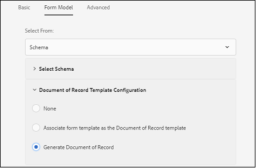

# Rekommenderade arbetsflöden för att aktivera dokumentgenerering för adaptiva formulär {#recommended-workflows-dor-generation}

Med hjälp av DoR (Document of Record) kan du spara information som du anger och skicka i en anpassningsbar form så att du kan hänvisa till den senare.
I DoR används en basmall för att definiera dess layout. Du kan generera en DoR-fil antingen med en standardmall eller genom att associera en annan mall med det adaptiva formuläret.

Mer information om hur du genererar en DoR-referens finns i [Skapa postdokument för anpassningsbara formulär](https://helpx.adobe.com/experience-manager/6-5/forms/using/generate-document-of-record-for-non-xfa-based-adaptive-forms.html).

Tjänsten [Automated forms conversion (AFCS)](/help/using/introduction.md) konverterar följande källformulär till anpassningsbara formulär:

* icke-interaktiv PDF forms
* Acro Forms
* XFA-baserad PDF forms

Beroende på vilket källformulär du använder för konvertering kan du generera en DoR-fil med:

* en standardmall
* källformuläret som mall - Om du väljer det här alternativet associerar konverteringstjänsten automatiskt källformuläret med det konverterade adaptiva formuläret som DoR-mallen.
* associera andra mallar med det konverterade adaptiva formuläret

I följande tabell visas ett exempel på hur DoR-mallen som du använder påverkar layouten för genererad DoR:

<table> 
 <tbody>
 <tr>
  <td>
<strong>Source Form</strong>
</td>
  <td>
<strong>Genererad DoR</strong>
</td> 
   </tr>
  <tr>
   <td></td>
   <td>
Om du använder standardmallen för att generera DoR: </td>
   </tr>
   <tr>
   <td></td>
   <td>
Om du använder källformuläret som mall för att generera DoR: 
</td>
   </tr>
  </tbody>
</table>

Om du använder källformuläret som mall behåller DoR-koden källformulärets layout, vilket framgår av tabellen.
I den här artikeln beskrivs de rekommenderade sökvägarna för att generera en DoR-sats baserat på de tre typerna av källformulär.

<table> 
 <tbody> 
  <tr> 
   <th><strong>Source Form</strong></th> 
   <th><strong>Metoder som genererar DoR</strong></th> 
  </tr> 
  <tr> 
   <td>
Icke-interaktiv PDF forms
</td> 
   <td> 
    <ul> 
     <li><a href="#generate-document-of-record-using-cloud-configuration">Aktivera DoR-generering före adaptiv formulärkonvertering för att generera DoR med en standardmall</a></li> 
     <li><a href="#edit-adaptive-form-properties-generate-document-of-record">Redigera anpassningsbara formuläregenskaper efter adaptiv formulärkonvertering för att aktivera DoR-generering med standardvärden eller någon annan formulärmall</a></li> 
    </ul> </td> 
  </tr>
  <tr> 
   <td>
Acro Forms eller XFA-baserad PDF forms
</td> 
   <td> 
    <ul> 
     <li><a href="#use-input-form-as-template-to-generate-document-of-record">Aktivera DoR-generering före adaptiv formulärkonvertering för att generera DoR med källformuläret som mall</a></li> 
     <li><a href="#edit-adaptive-form-properties-to-generate-document-of-record">Redigera adaptiva formuläregenskaper efter adaptiv formulärkonvertering för att aktivera DoR-generering med standardmall, källformulär som mall eller någon annan formulärmall</a></li> 
    </ul> </td> 
  </tr>    
 </tbody> 
</table>

## Generera arkivdokument för icke-interaktiv PDF forms {#generate-document-of-record-non-interactive-pdf}

Om du använder ett icke-interaktivt PDF-formulär som källformulär för tjänsten Automated forms conversion (AFCS) kan du:

* aktivera DoR-generering innan adaptiv formulärkonvertering används för att generera DoR med en standardmall
* eller redigera anpassningsbara formuläregenskaper efter adaptiv formulärkonvertering för att aktivera DoR-generering med standardformulärmallar eller någon annan formulärmall

### Aktivera DoR-generering före konvertering för att generera DoR med standardmall {#generate-document-of-record-using-cloud-configuration}

1. Välj **[!UICONTROL Tools]** > **[!UICONTROL Cloud Services]** > **[!UICONTROL Automated Forms Conversion Configuration]** > Egenskaper för molnkonfiguration som används för konvertering > **[!UICONTROL Advanced]** > alternativet **[!UICONTROL Generate Document of Record]**.

   

1. Tryck på **[!UICONTROL Save & Close]** för att spara inställningarna.

1. [Kör konverteringen](/help/using/convert-existing-forms-to-adaptive-forms.md). Se till att du använder den molnkonfiguration som har redigerats i steg 1 av dessa instruktioner.
När du skickar det konverterade adaptiva formuläret genereras DoR automatiskt med standardmallen.

### Redigera anpassningsbara formuläregenskaper efter konvertering för att aktivera DoR-generering {#edit-adaptive-form-properties-generate-document-of-record}

Om du inte aktiverar DoR-generering innan du konverterar källformuläret till ett anpassat formulär kan du fortfarande göra det efter konverteringen.

1. [Kör konverteringen](/help/using/convert-existing-forms-to-adaptive-forms.md) på det icke-interaktiva PDF-formuläret för att generera ett adaptivt formulär.

1. Markera det adaptiva formuläret i mappen **[!UICONTROL output]** och tryck på **[!UICONTROL Properties]**.

1. Expandera avsnittet **[!UICONTROL Document of Record Template Configuration]** på fliken **[!UICONTROL Form Model]** och välj **[!UICONTROL Generate Document of Record]**.

   

1. Tryck på **[!UICONTROL Save & Close]** för att spara inställningarna.

När du skickar det konverterade adaptiva formuläret genereras DoR automatiskt med standardmallen. Om du vill koppla en annan DoR-mall till det konverterade adaptiva formuläret kan du välja alternativet **[!UICONTROL Associate form template as the Document of Record template]**.

## Generera urkunder för Acro Forms eller XFA-baserad PDF forms {#generate-document-of-record-acroform-xfaform}

Om du använder ett Acro-formulär eller ett XFA-baserat PDF-formulär som källformulär för tjänsten Automated forms conversion (AFCS) kan du:

* aktivera DoR-generering före adaptiv formulärkonvertering för att generera DoR med källformuläret som mall

* eller redigera adaptiva formuläregenskaper efter adaptiv formulärkonvertering för att aktivera DoR-generering med standardmall, källformulär som mall eller någon annan formulärmall

### Aktivera DoR-generering före konvertering för att generera DoR med källformulärsmallen {#use-input-form-as-template-to-generate-document-of-record}

1. Välj **[!UICONTROL Tools]** > **[!UICONTROL Cloud Services]** > **[!UICONTROL Automated Forms Conversion Configuration]** > Egenskaper för molnkonfiguration som används för konvertering > **[!UICONTROL Advanced]** > alternativet **[!UICONTROL Generate Document of Record]**.

1. Tryck på **[!UICONTROL Save & Close]** för att spara inställningarna.

1. [Kör konverteringen](/help/using/convert-existing-forms-to-adaptive-forms.md). Se till att du använder den molnkonfiguration som har redigerats i steg 1 av dessa instruktioner.
Konverteringstjänsten kopplar automatiskt Acro-formuläret eller XFA-formuläret PDF till det konverterade adaptiva formuläret som DoR-mallen.
Du kan öppna de adaptiva formuläregenskaperna för att visa DoR-mallen i avsnittet **[!UICONTROL Document of Record Template Configuration]** på fliken **[!UICONTROL Form Model]**.

   

   När du skickar det konverterade adaptiva formuläret genereras DoR automatiskt med källformulärmallen.

### Redigera anpassningsbara formuläregenskaper efter konvertering för att aktivera DoR-generering {#edit-adaptive-form-properties-to-generate-document-of-record}

1. [Kör konverteringen](/help/using/convert-existing-forms-to-adaptive-forms.md) på det icke-interaktiva PDF-formuläret för att generera ett adaptivt formulär.

1. Markera det adaptiva formuläret i mappen **[!UICONTROL output]** och tryck på **[!UICONTROL Properties]**.

1. Utöka avsnittet **[!UICONTROL Document of Record Template Configuration]** på fliken **[!UICONTROL Form Model]** och välj **[!UICONTROL Generate Document of Record]** för att aktivera DoR-generering med standardmallen.
Du kan också välja alternativet **[!UICONTROL Associate form template as the Document of Record template]** och välja mallen för att aktivera DoR-generering med hjälp av källformulärsmallen eller någon annan formulärmall.

1. Tryck på **[!UICONTROL Save & Close]** för att spara inställningarna.
