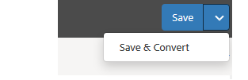

# Granska och korrigera konverterade formulär{#review-and-correct-converted-forms}

AEM Forms Automated forms conversion-tjänsten (AFCS) identifierar fält, innehåll och layout i det inmatade PDF-dokumentet och konverterar PDF-dokumentet till ett anpassningsbart formulär. Utdataanpassningsbara formulär kan innehålla några få saknade eller felaktigt konverterade fält. Du kan använda redigeraren Granska och korrigera för att göra förbättringar i identifierade fält och återskapa det adaptiva formuläret för att få ett resultat som ligger närmare det önskade resultatet. Efter den första konverteringen kan du öppna indatadokumentet PDF i redigeraren för att:

* Visa alla fält och innehåll som identifieras vid konverteringen
* Identifiera fält och innehåll som saknas under konverteringen
* Verifiera typen av fält och ändra dess typ om det behövs
* Verifiera identifierade tabeller, ändra storlek på kolumnerna och ändra cellinnehåll
* Ta bort felaktigt identifierade fält

När du har gjort ändringarna skickar du om PDF forms till konverteringstjänsten. Vid en lyckad konvertering hämtas uppdaterade resurser, inklusive det adaptiva formuläret och schemat, till din AEM Forms-instans. Du kan upprepa processen tills önskad upplevelse uppnås. 

Du behöver webbläsaren Google Chrome, Mozilla FireFox eller Microsoft Edge för att kunna använda gransknings- och korrigeringsredigeraren. Redigeraren stöder inte Internet Explorer.

## Välkommen till gransknings- och korrigeringsredigeraren {#welcome-to-review-and-correct-editor}

Redigeraren Review and Correct är ett lättanvänt gränssnitt. Den har följande komponenter:

* Innehållsläsare: Du kan använda innehållsläsaren för att ändra ett elements position. I innehållsläsaren kan du dra och släppa ett formulärobjekt för att ändra dess position. Du kan till exempel flytta en tabell före en textruta. Det ändrar tabbordningen för utdata i anpassat format.
* Egenskapsläsaren: Här visas egenskaperna för ett markerat fält. Du kan också ändra egenskaperna.
* Verktygsfält: Verktygsfältet visas högst upp i redigeraren. Här visas verktyg för att lägga till, ändra, gruppera, dela upp och ta bort fält.
* Öppna egenskaper: Alternativet Öppna egenskaper visas när användaren trycker på ikonen . Du kan klicka på öppna egenskaper för att öppna formuläregenskaper och visa ytterligare alternativ.
* Filterknapp: Filterknappen  är högst upp i redigeraren. Du kan filtrera fälten så att endast texter, fält, urvalsgrupper, paneler eller alla komponenter visas.
* Spara-knapp: Knappen **[!UICONTROL Save]** finns i redigerarens övre högra hörn. Du kan också använda pilen bredvid knappen Spara för att visa alternativet att skicka formuläret för konvertering.

* PDF-formulär: Redigeraren visar källdokumentet PDF och övertäcker det med identifierade fält. Du kan använda verktygen i verktygsfältet för att ändra fälten.
* Sidor: Ett källformulär kan innehålla flera sidor. Redigeraren har en knapp i det övre högra hörnet för att navigera mellan sidorna.

**A.** Innehållsläsaren **B.** Egenskapsläsaren **C.** Verktygsfältet **D.** Egenskapsknappen **E.** Filterknappen **F.** Knappen Spara **G.** PDF-formuläret har överlagrats med identifierade fält

Efter den första lyckade konverteringen lägger konverteringstjänsten över PDF-källdokumentet med identifierade fält och komponenter. Dessa fält eller komponenter är av typen: Text, Fält, Panel, Alternativgrupp och Tabell:

* Text: Oformaterad text i PDF-källdokumentet. Till exempel texten Låneprogram i bilden ovan.
* Fält: Kombination av text- eller ikonetikett som är kopplad till ett värde eller en inmatningsruta. Till exempel namnet på fältet Förnamn i bilden ovan. Den har en textetikett och en inmatningsruta. Ett fält har stöd för datatyperna text, numerisk, listruta, datum, e-post, telefonnummer, signatur, valuta och lösenord.
* Panel: Logisk samling med innehåll och komponenter. Exempel: Personinformation för panelerna Person 1 och Person 2 i bilden ovan.
* Alternativgrupp: En kombination av text som är kopplad till flera alternativ: kryssruta och alternativknapp. Exempel: Marital status och Befintlig kund i bilden ovan.\
  Beroende på urvalsgruppens bildtext och dess alternativ för flerval konverterar konverteringstjänsten automatiskt en urvalsgrupp till en alternativknapp eller en kryssruta för flerval. Om det till exempel finns **Välj ett** som urvalsgruppbeskrivning eller flervalsalternativ tillåter att du bara väljer ett alternativ, **Ja** eller **Nej**, konverterar konverteringstjänsten automatiskt urvalsgruppen till en envalsalternativknapp. På samma sätt gäller att om det finns **Markera alla som gäller** eller **Markera flera** som urvalsgruppbeskrivning eller om du kan välja flera alternativ med flervalsalternativ, konverterar konverteringstjänsten automatiskt urvalsgruppen till en kryssruta där flera alternativ kan väljas.

* Tabell: En 2D-tabell med information som representeras i kolumner och rader. Du kan lägga till eller ta bort rader eller kolumner i en tabell.

## Börja granska en konvertering {#start-reviewing-a-conversion}

Efter den första lyckade konverteringen lägger konverteringstjänsten över PDF-källdokumentet med identifierade fält och komponenter. Du kan förbättra identifierade fält och återskapa det anpassade formuläret för att få ett bättre resultat än det önskade. Du kan bara börja granska en konvertering efter den första konverteringen.

### Innan du börjar {#before-you-start}

* Gransknings- och korrigeringsredigeraren stöder inte fragment. Använd inte redigeraren för att granska konverteringar som hade alternativet **Extrahera fragment** aktiverat under konverteringar. Du kan använda den [anpassningsbara formulärredigeraren](https://helpx.adobe.com/experience-manager/6-5/forms/using/introduction-forms-authoring.html) för sådana konverteringar.

* Gransknings- och korrigeringsredigeraren har inte ångringsåtgärd. Använd knappen Spara bara för att spara ändringarna permanent.

### Starta granskningen {#start-the-review}

Om du vill börja granska konverteringar markerar du PDF-källdokumentet som används för konverteringen och markerar och trycker på **Granska konverteringar**. Redigeraren Granska och korrigera öppnas på en ny flik. Du kan börja granska konverteringar. Utför följande grundläggande kontroller innan du börjar åtgärda något annat problem:

1. **Kontrollera typen för alla fält**: Konverteringstjänsten kan tilldela fel typ till ett fält. Skriv text tilldelas till exempel i stället för att skriva telefon till mobiltelefonfältet. Du kan hålla muspekaren över ett fält för att hitta fälttypen.

   Om du vill ändra typ för ett fält markerar du fältet, öppnar egenskapsläsaren, väljer ett värde i listrutan **[!UICONTROL Type]** och trycker på **[!UICONTROL Save]**. Typen ändras.

   

1. **Ta bort extra paneler**: Konverteringstjänsten kan generera extra paneler. En extra underpanel ingår till exempel i den överordnade panelen. Tomt utrymme konverteras till en panel. En kryssruta konverteras till en panel. Granska gränserna för alla paneler och ta bort extra paneler. Du kan använda filterknappen  eller innehållsläsaren för att visa alla paneler.

   Du kan ta bort eller dela upp en panel om du vill ta bort den. När du använder borttagningsalternativet tas även de underordnade fälten eller komponenterna på panelen bort:

   * Om du vill ta bort en panel markerar du panelen och trycker på ikonen Ta bort  i verktygsfältet. Tryck på **[!UICONTROL Confirm]** i bekräftelsedialogrutan. Tryck på **[!UICONTROL Save]** för att spara ändringarna.

   * Om du vill dela upp en panel markerar du panelen och trycker på ikonen Dela upp i verktygsfältet. Panelen är uppdelad och underordnade fält i den uppdelade panelen justeras till det överordnade fältet. Tryck på **[!UICONTROL Save]**&#x200B;för att spara ändringarna.

1. **Skapa logiska grupper av text**: Verifiera de identifierade texterna för fullständighet och korrekthet. Kontrollera också att texterna är logiskt placerade i rätt paneler eller grupper. I en layout med flera kolumner kan du till exempel placera texten för en logisk grupp i en annan grupp.

   * Om du vill granska textens fullständighet och korrekthet kan du använda filterknappen  för att endast visa text, klicka på varje text och validera. Åtgärda stavnings-, stavnings- eller grammatikproblem, om sådana finns.

   * Om du vill lägga till text i formuläret trycker du på plusknappen (+) och trycker på **[!UICONTROL Text]**. Draw rutan, öppna egenskapsgranskaren och skriv texten som ska läggas till i rutan Innehåll.

1. **Granska tabeller:** Se till att alla kantlinjer i tabellen identifieras. Se även till att innehållet i cellerna identifieras korrekt.

   * Använd alternativet **[!UICONTROL Add Column]** eller **[!UICONTROL Add Row]** om du vill identifiera saknade kantlinjer.

   * Använd alternativet **[!UICONTROL Delete Column]** eller **[!UICONTROL Delete Row]** om du vill ta bort extra kantlinjer.

När du har gjort nödvändiga ändringar trycker du på knappen **[!UICONTROL Save & Convert]** för att skicka om PDF forms till konverteringstjänsten. Varje fält konverteras till motsvarande adaptiva fältkomponent. Efter konverteringen hämtas de uppdaterade resurserna, inklusive det adaptiva formuläret och schemat, till din AEM Forms-instans. Beroende på hur komplicerat formuläret är kan det ta lite tid att slutföra konverteringen.

När du har utfört de grundläggande kontrollerna kan du granska formuläret för att åtgärda problem som är specifika för organisationen. De här problemen kan vara relaterade till att lägga till saknade fält, och mycket annat. Du kan visa avsnittet [Använd verktygen för granskning och korrigering](review-correct-ui-edited.md#use-the-review-and-correct-editor-tools) om du vill veta mer om alla verktyg som redigeraren har för att åtgärda problem.

Du kan också arbeta med att identifiera identiska problem som uppstår i nästan alla dina formulär och rapportera sådana mönster till Adobe. Använd redigeraren Granska och korrigera tills önskad upplevelse är nådd.

## Använda verktygen för granskning och korrigering {#use-the-review-and-correct-editor-tools}

Med gransknings- och korrigeringsredigeraren kan du

* [Lägga till en komponent i formuläret](review-correct-ui-edited.md#add-a-component-to-the-form)
* [Lägga till eller redigera en tabell](review-correct-ui-edited.md)
* [Ändra typ för en komponent](review-correct-ui-edited.md#change-type-a-component)

* [Skapa eller ta bort en panel](review-correct-ui-edited.md#create-or-remove-a-panel)
* [Ta bort en panel eller komponent](review-correct-ui-edited.md#delete-a-panel-or-component)
* [Ange egenskaper för en komponent](review-correct-ui-edited.md#set-properties-of-a-component)
* [Skicka ett formulär för konvertering](review-correct-ui-edited.md#send-a-form-for-conversion)

### Lägga till en komponent i formuläret {#add-a-component-to-the-form}

Konverteringstjänsten kanske inte identifierar vissa komponenter i utskriftsformuläret. I till exempel en **Födelsedatum** -komponent i ett formulär identifieras inte under konverteringen. Du kan använda verktyget **+** för att identifiera sådana komponenter. Med verktyget kan du lägga till text, fält, alternativgrupper, tabeller och panelkomponenter.

Om du vill lägga till en komponent i formuläret trycker du på **[!UICONTROL +]** och sedan på **[!UICONTROL Field]**. Draw är en ruta som innehåller fältets etikett och inmatningsruta. Exempelbilden ovan använder till exempel fältkomponenten för att lägga till etiketten **Födelsedatum** och värderutan nedanför till formuläret. När du ritar rutan identifierar konverteringstjänsten fälttypen. Du kan ändra fälttypen i egenskapswebbläsaren om det behövs. När du har skapat komponenten öppnar du egenskapsläsaren och anger komponentens egenskaper.

Tryck på knappen **[!UICONTROL Save]** om du vill spara ändringarna eller använd knappen **[!UICONTROL Save & Convert]** om du vill skicka om PDF forms till konverteringstjänsten.

### Lägga till eller redigera en tabell {#addedittable}

Konverteringen kan göra att ett fåtal celler, gränser eller innehåll i en tabellcell inte identifieras. En rad i en tabell identifieras till exempel inte. Du kan använda redigeraren Granska och korrigera för att identifiera sådana objekt. Du kan utföra följande åtgärder för en tabell:

* Om du vill markera en tabell klickar du på en cell i tabellen.
* Om du vill ändra egenskaper för en cell, till exempel namn, titel eller typ, dubbelklickar du på en cell. Du kan också dubbelklicka på cellen för att ändra innehållet, markera ett fält som krävs och välja andra egenskaper.
* Använd verktyget **[!UICONTROL +]** om du vill lägga till/identifiera en helt oidentifierad eller ny tabell i formuläret.
* Om du vill ändra storlek på celler eller rader i en tabell klickar du en gång på tabellens tomma område, håller pekaren över rad- eller kolumngränsen när markören ändras, markerar och flyttar gränsen. När du har ändrat storlek klickar du på **[!UICONTROL Done]** för att genomföra ändringarna. Du kan trycka på **[!UICONTROL ESC]** om du vill ta bort storleksändringen.

* Om du vill lägga till eller ta bort rader eller kolumner markerar du en cell i tabellraden och väljer alternativet **[!UICONTROL Add Row]**, **[!UICONTROL Add Column]**, **[!UICONTROL Delete Row]** eller **[!UICONTROL Delete Column]** på menyn .

* Om du vill dela en cell i en tabell väljer du alternativet **[!UICONTROL Spilt Vertical]** eller **[!UICONTROL Split Horizontal]** på menyn .

* Om du vill sammanfoga celler i en tabell markerar du cellerna som ska sammanfogas och väljer alternativet **[!UICONTROL Merge Cells]** på tabellmenyn i .

### Ändra typ för en komponent {#change-type-a-component}

Konverteringstjänsten kan skapa fält av felaktig typ. I följande bild identifieras till exempel fältet **Kön** felaktigt som ett **Text**-fält. Innehållet i etiketten är dessutom felaktigt. Fältet ska vara en urvalsfälttyp och etiketten ska vara Kön. Så här ändrar du typ av komponent och korrigerar dess etikett:

Markera fältet som ska konverteras, tryck på  och tryck på en fälttyp. Fältet konverteras till vald fälttyp. Ett fält kan bara konverteras till de typer som listas i följande tabell. En panelkomponent kan bara delas upp, inte omformas.

| **Komponent** | **Konverterar till** |
|---|---|
| Text | Fält eller urvalsgrupp |
| Fält | Text eller alternativgrupp |
| Urvalsgrupp | Text eller panel |

När du har konverterat egenskaperna öppnar du egenskapsläsaren, anger etikett och anger andra obligatoriska egenskaper. Tryck på knappen **[!UICONTROL Save]** om du vill spara ändringarna eller använd knappen Spara och konvertera för att skicka om PDF forms till konverteringstjänsten.

### Skapa eller ta bort en panel {#create-or-remove-a-panel}

Konverteringstjänsten samlar relaterade komponenter och innehållet i tryckta formulär på en panel. Formuläret kan t.ex. ha en adresspanel med fält som namn, ritnummer, område, stad, delstat, postnummer och land. Dessa fält grupperas på en panel. Ett formulär kan ha flera paneler.

Med konverteringstjänsten kan du skapa paneler som har komponenter utan relation till andra eller lämna en relativ komponent utanför panelen. Du kan använda verktygen för att gruppera och dela upp grupper för att korrigera sådana paneler:

* Om du vill ta bort en panel markerar du panelen och trycker på Dela upp . Panelen tas bort och panelens underordnade komponenter flyttas till den överordnade komponenten. Du kan också använda alternativet [Ta bort komponent](review-correct-ui-edited.md#delete-a-panel-or-component) för att ta bort en panel och dess underordnade paneler.

* Om du vill skapa en panel använder du Ctrl-tangenten (i Windows eller Linux) eller Ctrl-tangenten (i Mac) för att markera relaterade komponenter och trycker på  för att skapa en panel. Öppna egenskapsbläddraren för att ange panelens egenskaper.

Tryck på knappen **[!UICONTROL Save]** om du vill spara ändringarna eller använd knappen **[!UICONTROL Save & Convert]** om du vill skicka om PDF forms till konverteringstjänsten.

### Ta bort en panel eller komponent {#delete-a-panel-or-component}

Konverteringstjänsten kan identifiera vissa felaktiga paneler eller komponenter. De flesta av dessa komponenter i panelerna är icke-relaterade. Du kan ta bort sådana paneler eller komponenter.

Om du vill ta bort en panel eller komponent markerar du en panel eller komponent och trycker på ikonen Ta bort . Tryck på **[!UICONTROL Confirm]** i bekräftelsedialogrutan. Den markerade panelen eller komponenten tas bort. När du tar bort en panel tas även panelens underordnade bort. Du kan använda Ctrl-tangenten (Windows eller Linux) eller Ctrl-tangenten (Mac) för att markera flera komponenter eller paneler.

### Ange egenskaper för en komponent {#set-properties-of-a-component}

Varje komponent i formuläret har en uppsättning egenskaper som namn, titel, typ. Om du vill ange egenskaperna för en komponent markerar du komponenten och trycker på egenskapsläsaren. Egenskaper för den markerade komponenten visas. Ändra eller ange egenskaperna.

Tryck på knappen **[!UICONTROL Save]** om du vill spara ändringarna eller använd knappen **[!UICONTROL Save & Convert]** om du vill skicka om PDF forms till konverteringstjänsten.

### Skicka ett formulär för konvertering {#send-a-form-for-conversion}

När du har gjort alla ändringar du behöver i gransknings- och korrigeringsredigeraren kan du skicka om formuläret för konvertering. Om du vill skicka formuläret för konvertering trycker du på **[!UICONTROL Save & Convert]**. **[!UICONTROL Sent for conversion label]** tillämpas på den mapp som innehåller källdokumentet och det uppdaterade källformuläret överförs till konverteringstjänsten som körs på Adobe I/O.

Beroende på formulärets komplexitet kan det ta lite tid att konvertera formuläret. När konverteringen är klar hämtas det konverterade adaptiva formuläret och relaterade resurser till datorn. Du kan granska formuläret i redigeraren när konverteringen är klar och öppna det adaptiva formuläret i [adaptiv formulärredigerare](https://helpx.adobe.com/experience-manager/6-5/forms/using/introduction-forms-authoring.html) för att se den slutliga uppsättningen korrigeringar, om det behövs.

Om du skickar om ett formulär för konvertering efter att ha uppdaterat formuläret i en anpassad formulärredigerare, försvinner alla ändringar som gjorts i ett anpassat formulär. Du kan bara öppna ett formulär i granskningsläge och korrigera redigeraren efter en lyckad konvertering.

<!--
Comment Type: draft

<h3>Open adaptive forms editor</h3>
-->

<!--
Comment Type: draft

There can be instances where you require adaptive forms editor to make the changes like, applying a different theme to the form or fixing tables. Once you have made all the required changes in Review and Correct editor and converted the form, you can open your form in adaptive forms editor to make the final set of changes.

To open the form with adaptive forms editor, tap the  icon, and tap <strong>Open Adaptive Form Editor</strong>. The form opens in adaptive form editor. 

## Previous {#previous}

[Use Automated Forms Conversion service](convert-existing-forms-to-adaptive-forms.md)
-->
