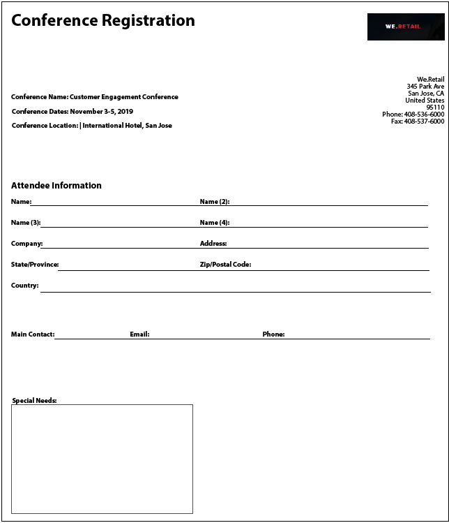

# Bästa praxis och kända komplexa mönster {#Best-practices-and-considerations2}

Det här dokumentet innehåller riktlinjer och rekommendationer som formuläradministratörer, författare och utvecklare kan dra nytta av när de arbetar med [!DNL Automated Forms Conversion service]. Här diskuteras bästa praxis direkt från att förbereda källformulär till att korrigera komplexa mönster som kräver extra arbete för automatiserad konvertering. Dessa bästa metoder bidrar tillsammans till prestanda och resultat för [!DNL Automated Forms Conversion service].

## God praxis

Konverteringstjänsten konverterar PDF forms som finns på din AEM [!DNL Forms] -instans till adaptiva formulär. De bästa metoderna nedan hjälper dig att förbättra konverteringshastigheten och exaktheten. Dessutom kan du spara tid på konverteringsaktiviteter med hjälp av de här metoderna.

### Innan du överför källan

Du kan överföra alla PDF forms samtidigt eller i faser efter behov. Tänk på följande innan du laddar upp formulären:

* Behåll antalet formulär i en mapp under 15 och behåll det totala antalet sidor i en mapp under 50.
* Låt mappen vara mindre än 10 MB. Lägg inte formulär i en undermapp.
* Behåll antalet sidor i ett formulär under 15.
* Ordna källdokumenten i en grupp om 8-15 dokument. Behåll källformulären med vanliga adaptiva formulärfragment i en enda batch.
* Överför inte skyddade formulär. Tjänsten konverterar inte lösenordsskyddade och skyddade formulär.
* Överför inte [PDF Portfolio](https://helpx.adobe.com/acrobat/using/overview-pdf-portfolios.html). Tjänsten konverterar inte PDF Portfolio till en anpassningsbar form.
* Ladda inte upp källformulär med blanksteg i filnamnet. Ta bort utrymmet från filnamnet innan du överför formulären.
* Skicka inte skannade, ifyllda och formulär på andra språk än engelska, franska, tyska, spanska, italienska och portugisiska. Sådana formulär stöds inte.

När du använder ett XDP-formulär för konvertering utför du följande steg innan du överför XPD-källformulären:

* Analysera XDP-formuläret och åtgärda visuella problem. Kontrollera att källdokumentet använder avsedda kontroller och strukturer. Källformuläret kan t.ex. ha kryssrutor i stället för alternativknappar för en enskild markering. Ändra kryssrutorna till alternativknappar för att skapa ett anpassat formulär med avsedda komponenter.
* [Lägga till bindningar i XDP-formuläret](http://www.adobe.com/go/learn_aemforms_designer_65) innan konverteringen startas. När bindningar är tillgängliga i XDP-källformuläret lägger tjänsten automatiskt till bindningar till motsvarande adaptiva formulärfält under konverteringen. Den sparar tid som krävs för att manuellt tillämpa bindningarna.
* [Lägg till Adobe Sign-taggar](https://helpx.adobe.com/sign/using/text-tag.html) till XDP-filen. Tjänsten konverterar automatiskt Adobe Sign-taggar till motsvarande anpassningsbara formulärfält. Adaptiv Forms har stöd för ett begränsat antal Adobe Sign-fält. En fullständig lista över fält som stöds finns i [Använda Adobe Sign i en adaptiv form](https://experienceleague.adobe.com/docs/experience-manager-65/forms/adaptive-forms-advanced-authoring/working-with-adobe-sign.html?lang=en) dokumentation.
* Konvertera om möjligt komplexa tabeller i XDP-dokument till enkla tabeller. En tabell med formulärfält i tabellceller, celler med olika storlek, celler med rad- eller kolumnutvidgning, sammanfogade celler, partiella kanter eller utan synliga kantlinjer anses vara en komplex tabell. En tabell med någon av de ovannämnda posterna anses vara en komplex tabell.
<!-- * Use sub-forms in XDP documents to create panels in adaptive forms. Service converts each sub-form to one or more adaptive form panels during conversion. -->

### Innan du påbörjar konverteringen

* Skapa anpassningsbara blankettmallar. Med mallar kan du ange en enhetlig struktur för formulär i din organisation eller avdelning.
* Ange sidhuvud och sidfot i de adaptiva formulärmallarna. Tjänsten ignorerar sidhuvudet/sidfoten i källdokument och använder sidhuvud/sidfot som anges i den adaptiva formulärmallen.
* Skapa anpassningsbara formulärteman. Teman ger ett enhetligt utseende och en enhetlig känsla för olika delar av organisationen eller avdelningen.
* Konfigurera formulärdatamodellen för att spara och hämta från en datakälla. Skapa och konfigurera läs- och skrivtjänster för formulärdatamodellen.
* Skapa adaptiva formulärfragment och konfigurera tjänsten så att den använder dina adaptiva formulärfragment.
* Ta fram arbetsflödesmodeller för de blanketter som kräver automatisering av affärsprocesser.
* Konfigurera Adobe Analytics, om det behövs

## Lär känna komplexa mönster

AEM [!DNL Forms Automated Conversion service] använder artificiell intelligens och maskininlärningsalgoritmer för att förstå källformulärets layout och fält. Alla maskininlärningstjänster lär sig kontinuerligt av källdata och skapar bättre resultat vid varje förändring. Dessa tjänster lär sig av erfarenheter som människor.

[!DNL Automated Forms Conversion service] har utbildats i en stor uppsättning formulär. Den identifierar enkelt fält i ett källformulär och skapar anpassningsbara formulär. Det finns dock vissa fält och format i PDF forms som är lätta att se för det mänskliga ögat men svåra att förstå för tjänsten. Tjänsten kan tilldela vissa fält eller format andra fälttyper eller paneler än de som är tillämpliga. Alla sådana fält- och formatmönster listas nedan.

Tjänsten börjar identifiera och tilldela rätt fält eller paneler till dessa mönster när den lär sig av källdata. Just nu kan du använda [Granska och korrigera](review-correct-ui-edited.md) för att åtgärda sådana problem. Innan du börjar åtgärda problemen eller läser mer, bör du bekanta dig med [adaptiva formulärkomponenter](https://helpx.adobe.com/experience-manager/6-5/forms/using/introduction-forms-authoring.html).

### Allmänna mönster {#general}

| Mönster | Exempel |
|--- |--- |
| **Mönster**  Tjänsten konverterar inte ifyllt PDF forms till ett anpassat formulär.   **Upplösning**  Använd tomma adaptiva formulär. |  |
| **Mönster**  Tjänsten kan inte identifiera text och fält i tätt format.   **Upplösning**   Öka bredden mellan text och fält i ett kompakt formulär innan konverteringen startar. |  |
| **Mönster**  Tjänsten stöder inte skannade formulär.   **Upplösning**  Använd inte skannade formulär. |  |
| **Mönster**  Tjänsten extraherar inte bilder och text i bilder.   **Upplösning**   Lägg till bilder eller text manuellt i konverterade formulär. |  |
| **Mönster**  Tabeller med prickade eller otydliga gränser och kanter konverteras inte.   **Upplösning**  Använd tabeller med tydliga gränser och ramar. stöds. |  |
| **Mönster**   Anpassade formulär har inte stöd för lodrät text som skrivs ut. Tjänsten konverterar alltså inte lodrät text till motsvarande Adaptiv Forms-text.   **Upplösning**   Använd adaptiv formulärredigerare för att lägga till lodrät text, om det behövs. |  |

### Urvalsgrupp  {#choice-group}

| Mönster | Upplösning |
|--- |--- |
| **Mönster**   Alternativ för alternativgrupper med andra former än rutor och cirklar konverteras inte till motsvarande adaptiva formulärkomponenter.   **Upplösning**   Ändra former för alternativ till ruta eller cirkel eller använd Gransknings- och korrigeringsredigeraren för att identifiera formerna. |  |

### Formulärfält {#form-fields}

| Mönster | Upplösning |
|--- |--- |
| **Mönster**   Tjänsten identifierar inte fält utan tydliga gränser.   **Upplösning**   Använd Gransknings- och Korrigera-redigeraren för att identifiera sådana fält. |  |
| **Mönster**   Tjänsten kan inte identifiera formulärfält för urvalsgrupper med bildtexter längst ned eller till höger i ett formulär.   **Upplösning**   Använd gransknings- och korrigeringsredigeraren för att identifiera sådana fält |  |
| **Mönster**   Tjänsten sammanfogar eller tilldelar fel typ till vissa formulärfält som är placerade mycket nära varandra eller som inte har några tydliga kanter.   **Upplösning**   Använd Gransknings- och Korrigera-redigeraren för att identifiera sådana fält. |  |
| **Mönster**   Tjänsten kan inte identifiera fält med långt borta bildtexter eller en prickad linje mellan bildtexten och inmatningsfältet.   **Upplösning**   Använd formulärfält med tydliga gränser eller använd Gransknings- och Korrigeringsredigerare för att åtgärda sådana problem. |  |

### Listor {#lists}

| Mönster | Upplösning |
|--- |--- |
| **Mönster**  Listor som innehåller formulärfält sammanfogas eller konverteras inte till motsvarande adaptiva formulärkomponenter   **Upplösning**  Använd formulärfält med tydliga gränser eller använd Gransknings- och Korrigeringsredigerare för att åtgärda sådana problem. |  |
| **Mönster**  Tjänsten kan lämna några kapslade listor oidentifierade   **Upplösning**   Använd Gransknings- och Korrigera-redigeraren för att åtgärda sådana problem. |  |
| **Mönster**   Tjänsten sammanfogar vissa listor som innehåller urvalsgrupper med varandra   **Upplösning**   Använd Gransknings- och Korrigera-redigeraren för att åtgärda sådana problem. |  |

<!--
Comment Type: draft

<h3>Choice groups</h3>
-->

<!--
Comment Type: draft

<ul>
<li>Lists with form fields, nested lists, and nested choice groups are not supported.</li>
<li>Form fields with captions at bottom or right are not supported.</li>
<li>Form fields without borders are not supported.</li>
<li>Hidden form fields are not supported.</li>
<li>Button in PDF forms are not converted to adaptive form buttons.  </li>
<li>Tables with clear explicit boundaries and borders are supported.</li>
<li>Fields with far away captions are not supported.  </li>
<li>Choice groups with only box or circle shaped selectors are supported. </li>
</ul>
-->
